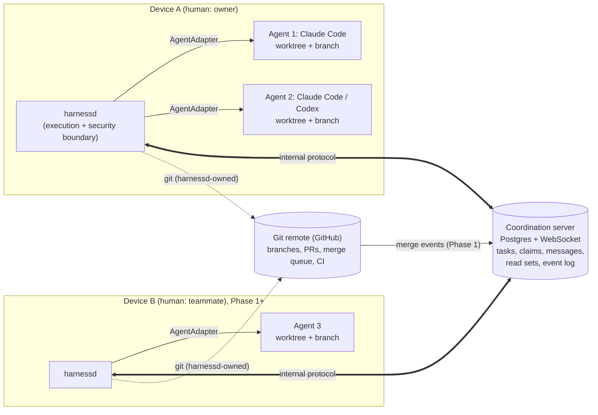

# Harness: master plan

> **Status (2026-10-03):** Planning approved as the initial source of truth (S4). **Phase 0A is built** (D-59 to D-84): every 0A exit criterion is met with a scripted model (`npm run demo`, D-84). **Phase 0B is approved (D-86)**, with the real-model check U-1 deferred until an API key exists ([Q-18](docs/open-questions.md#q-18)). The model endpoint is configurable, with no provider hardcoded; DeepSeek `deepseek-flash` comes first for development and benchmarking (D-87). Q-06 and Q-07 are resolved (D-88, D-89). **Owners:** vihAan02 and Daniyal Mughal, either of whom can approve a gate (D-85).
>
> **Next step:** see [§12](#12-what-must-happen-before-and-during-phase-0a). The short version: 0B's first stretch is built (D-90 to D-93) and the S3 example passes with the scripted model. The rest of 0B is approved and built in two parallel workstreams (D-94; rules in [AGENTS.md](AGENTS.md)), toward the functional MVP and then the formal A/B gate; a real-model run needs an API key (README, "Choosing a model provider").
>
> **This file is the source of truth.** If any other doc disagrees with it, this file wins. Fix the other doc.

**Labels used everywhere:**

| Label | Meaning | Where it lives |
|-------|---------|----------------|
| **D-xx** | Decision. Status is Locked, Direction, Proposal or Superseded (§7) | this file |
| **H-xx** | Hypothesis to test | this file |
| **R-x** | Risk (the owner's ranked concerns) | this file |
| **F-xx** | Researched fact, with a source, a check date and a confidence mark (✔✔ / ✔ / ◐ / ?) | [research/vendor-capabilities.md](docs/research/vendor-capabilities.md) |
| **C-x** | A place where research contradicted or qualified an earlier assumption | [research/vendor-capabilities.md](docs/research/vendor-capabilities.md) |
| **SP-xx** | Empirical spike result, labelled VERIFIED / CONTRADICTED / PARTIAL / UNVERIFIED with the exact versions tested | [research/spike-0a.md](docs/research/spike-0a.md) |
| **Q-xx** | Open question | [open-questions.md](docs/open-questions.md) |
| **TH-x / T-x** | Threat / security test | [security.md](docs/security.md), [validation.md](docs/validation.md) |
| **SC-x / M-x / P-x / G-x** | A/B scenario / metric / pass criterion / guardrail | [validation.md](docs/validation.md) |
| **PROPOSAL** | A default that's good to build with in its phase unless the owner objects. **Exception:** the A/B pass bar needs the owner's explicit approval before use (given for v1, D-57). | inline |

---

## 1. Context and provenance

These sources define this plan. Later sources win where they sharpen or override earlier ones.

| | Source | What it contributed |
|---|---|---|
| **S1** | [Architecture review](docs/source/2026-10-01-S1-architecture-review.md) | Evaluated an earlier "harness" proposal. Kept its core and fixed its blind spot: agents don't route their work through your MCP tools. Added the cross-human threat model, cut MVP scope, and proposed Phases 0–3 plus three validation tests. |
| **S2** | [Owner's ranked concerns](docs/source/2026-10-01-S2-owner-concerns.md) | Made stale context and read-set invalidation central. Added sparse typed messages, `AgentAdapter`, human-led task breakdown, deadlocks, local resource limits, secrets by reference, harder scope cuts, and the real baseline to beat. Became the risk register (§9). |
| **S3** | [Owner's final adjustments](docs/source/2026-10-01-S3-final-adjustments.md) | Keep the vision ambitious and the sequence disciplined. Added the Phase 0A/0B split, best-effort read sets, three claim levels, MCP as compatibility only, the identity model from day one, the contract-awareness direction, the A/B test as a first-class gate, and the core principles. |
| **S4** | [Owner's approval and 0A go-ahead](docs/source/2026-10-01-S4-owner-approval-and-0a-go.md) | Approved this plan as the initial source of truth. Answered Q-01 (TypeScript), Q-04 for experiments (API keys), Q-03 (pass bar approved, versioned) and Q-02 (a purpose-built benchmark repo, then a real project as a separate test). Approved Phase 0A, starting with an empirical spike of ten named assumptions (D-55 to D-59). |
| **S5** | [Owner accepts the spike](docs/source/2026-10-02-S5-owner-accepts-spike.md) | Accepted the spike results and D-60 to D-70, and approved going deeper into 0A from item 1 (D-71). Identified the owner (GitHub `vihAan02`, working with Daniyal Mughal). |
| **S6** | [Owner's picks for item 4](docs/source/2026-10-02-S6-owner-item4-picks.md) | Approved four choices for `harnessd` v0: TOML/YAML config, `harness approve` now, presence-only heartbeat events, a foreground daemon (D-75). |
| **S7** | [Owner's choice of the benchmark repo](docs/source/2026-10-03-S7-owner-bench-repo.md) | The benchmark app lives in its own repo, github.com/vihAan02/harness-bench, built in TypeScript on Node 24 with Node's built-in SQLite (D-83). |
| **S8** | [Owner records a co-owner](docs/source/2026-10-03-S8-owner-coowner.md) | Daniyal Mughal (GitHub `DaniyalMughal1`) is a co-owner. Either owner can approve an owner gate, and Daniyal continues from the handoff (D-85). |
| **S9** | [Co-owner approves 0B and sets the provider direction](docs/source/2026-10-03-S9-coowner-0b-go-and-providers.md) | Approved Phase 0B with U-1 deferred, Postgres 18 beside 17 on port 5433, and a configurable model provider with DeepSeek first (D-86, D-87). Resolved Q-06 and Q-07 (D-88, D-89). Set this stretch's stop point: the S3 example with the scripted model. |

**How this version was produced (2026-10-01):**
1. Written from S1–S3.
2. Vendor and infrastructure claims checked by seven research passes and two independent checkers (§11).
3. Reviewed by four critics (fidelity to S1–S3, cold reader, consistency, citation accuracy), with their findings fixed.

Decisions added during research and review are marked *research-derived* or *review-derived*. The owner can revise them like any other decision. A second review pass then tightened several decisions (D-26, D-31, D-35, D-47, D-48, D-50, D-51, D-53, D-54). Those refinements were made before this version became the source of truth; from now on, changes follow the supersede rule (D-44).

**Known gaps:**
- **The original proposal is missing.** The proposal S1 reviewed isn't available ([Q-12](docs/open-questions.md#q-12)). Its components are known only through S1's references: cloud coordination plane, `harnessd`, worktrees, MCP API, soft and hard claims, task snapshots, `harness://` on R2, and the integration queue.
- **Some vendor claims didn't hold up.** Where research contradicted or qualified S1–S3, §11 says so. Nothing was silently rewritten.

## 2. Vision: the product we are building toward

The end goal is a **multiplayer AI engineering harness** that supports:

- **Many humans,** many agents, many machines and many agent vendors.
- **Real-time, event-driven coordination.**
- **Task ownership.**
- **Soft and hard claims.**
- **Stale-context detection.**
- **Awareness of dependencies and contracts.**
- **Secure local execution.**
- **Cloud agents.** *(later)*
- **Shared artifacts.** *(later)*
- **Local, cloud and non-Git data sources.** *(later)*
- **A secure hybrid file/data fabric.** *(eventually)*

The ambition is intentional. It is not reduced by the size of Phase 0, and nothing in these docs should be read as narrowing it.

## 3. Thesis and wedge

> **Thesis:** A multiplayer coordination layer for humans and AI agents working across machines, models, and eventually data sources.

> **First wedge:** Multiple humans, each running their own AI coding agents on their own machines, coordinating on one repository as one AI-augmented engineering team.

- **Phase 0 is small on purpose.** It uses **one human on one machine** only because that's the fastest way to prove the coordination primitives. Don't confuse Phase 0's limits with the size of the product.
- **Code coordination comes first, and data sources stay part of the thesis.** S1 judged the "data layer across Drive and Notion" a weaker *first* wedge, because MCP connectors cover basic access today. Coordinating data sources with the same trust and stale-context guarantees is still half of the thesis. It's sequenced after code (§6, D-42).

## 4. Core principles

These are locked. Every doc and every future change must stay consistent with them.

1. **Share coordination, not disk state.**
2. **Git is the code synchronization layer.**
3. **The harness cloud is the coordination layer.**
4. **The local daemon is the execution and security boundary.**
5. **MCP is a compatibility layer, not an enforcement layer.**
6. **Stale context is a bigger problem than literal file collisions.**
7. **Claims are awareness mechanisms, not correctness guarantees.**
8. **Peer-agent communication is sparse and untrusted.**
9. **Task decomposition stays human-led initially.**
10. **Vendor-specific behaviour stays behind `AgentAdapter`.**
11. **The product vision stays ambitious; the implementation sequence stays disciplined.**

## 5. Architecture at a glance

**The pieces:**
- **Coordination server** (the "harness cloud"). It holds:
  - tasks, claims, typed messages and read sets;
  - presence;
  - an append-only event log with per-project cursors.
  
  In Phase 0 it runs locally.
- **`harnessd`.** A daemon on each machine. It:
  - supervises agents through `AgentAdapter`;
  - owns their worktrees, Git operations, ports, secrets and policy;
  - observes their edits and reads;
  - delivers messages at safe boundaries.
  
  It is the root of trust.
- **`AgentAdapter`.** One adapter per vendor: `ClaudeAdapter` in Phase 0, `CodexAdapter` in Phase 1. Vendor quirks never leak past it.
- **Agent-facing tools.** A thin shim over the internal protocol, exposed however the adapter supports it, for example an in-process MCP server. These tools are optional for agents. They're never the enforcement point and never the source of truth.
- **Git and GitHub.** Git moves code between machines. From Phase 1, pull requests and required CI handle integration, plus merge queue where available. The harness adds notices to affected agents after a merge.

**Details:**
- [architecture.md](docs/architecture.md): components, identity, flows.
- [coordination.md](docs/coordination.md): coordination semantics.
- [agent-adapters.md](docs/agent-adapters.md): the adapter interface and per-vendor mapping.
- [local-runtime.md](docs/local-runtime.md): what `harnessd` does on a laptop.
- [protocol.md](docs/protocol.md): the wire protocol and data model.
- [security.md](docs/security.md): the threat model.

## 6. Build sequence

| Phase | Proves | Main additions | Exit / gate |
|---|---|---|---|
| **0A** | The core coordination loop works | Adapter spike, a throwaway that verifies the riskiest vendor facts; `AgentAdapter` + `ClaudeAdapter`; repo executable config locked out (D-45) and vendor peer channels off (D-46); minimal `compilePermissions` (write confinement, shared-`.git` deny, sandbox on); worktree lifecycle with `harnessd`-owned Git (D-50); agent/task/session lifecycle (D-54); presence and status; typed messages `question`/`answer`/`claim_conflict`; prospective and observed soft claims; overlap warnings; event log with cursors (only as far as needed); internal protocol; approved setup command (D-52); per-agent ports; metrics capture | The harness knows who's alive, who owns what, what each agent is modifying, what others are doing, and when work likely overlaps. A question from A to B and the answer back complete at safe boundaries. |
| **0B** | Stale-context protection works | Read sets `(path, content hash)`; dependency invalidation and stale-context notices; worktree sync after a landed change (D-53); `wait_for(..., timeout)`; hard claims with fencing tokens; local land step (D-51); hook-based delivery (notices attached to tool results, Stop gate); read confinement good enough for T-1 | Security tests T-1, T-1b and T-2 pass, **then the A/B test runs against the baseline** ([validation.md](docs/validation.md)) |
| **Gate** | Coordination is materially better than "two terminals + two branches + a human relaying in Slack" | The controlled A/B test on the purpose-built benchmark repo; then a separate test on a real existing project (D-58) | The owner evaluates the results against the versioned pass bar (v1, D-57) and records go or no-go as a D-ID. If it fails, adjust the thesis before Phase 1. Whether Phase 1 also waits for the real-project test is [Q-17](docs/open-questions.md#q-17). |
| **1** | Multiplayer across people and vendors | A second human and device; `CodexAdapter`; the real identity and security model (signed commands, local approvals, local ∩ cloud); checkpoint pushes at meaningful boundaries; GitHub PRs + required CI (+ merge queue where available, D-51); post-merge notices; deadlock cycle detection; first contract-aware notices | Two humans on two machines finish coupled work with fewer incidents than the baseline. Security tests pass across people. |
| **2** | It works day to day | Dashboard; full policy compilation into each vendor's native config; worktree bootstrap (dependencies, secret references, services, DB state, generated files); local resource scheduler; R2 for shared artifacts | See the roadmap |
| **3** | Wider reach | Non-Git sources copied in read-only; cloud agents; a planner agent whose dependency graph a human approves; an integration and review agent; on-demand reads across devices; Drive and Notion sources | See the roadmap |
| **Horizon** | The full vision | The secure hybrid file/data fabric (`harness://` as a real cross-source address space) | n/a |

The full checklists are in [roadmap.md](docs/roadmap.md).

## 7. Decision register

**Status values:**
- **Locked:** decided.
- **Direction:** the direction is locked, and details are settled in the phase noted.
- **Proposal:** the default for its phase unless the owner objects.
- **Superseded:** replaced by a later decision. Old entries are kept, never deleted.

To change a decision, add a new D-ID that supersedes the old one, with the date and the reason.

### Product and scope
- **D-01 Thesis:** a multiplayer coordination layer for humans and AI agents across machines, models and, eventually, data sources.
  - *Source:* S3. *Status:* Locked.
- **D-02 The wedge is cross-human coordination on one repo.** Each human runs their own agents on their own machine under their own vendor account. Data sources follow.
  - *Why:* Today's parallel-agent tools are single-user (S1). Re-checked in [landscape.md](docs/research/landscape.md).
  - *Note:* S1 said "own subscription". "Vendor account" covers API keys too, because subscription mode is a terms grey zone (D-48, Q-04).
  - *Source:* S1, S3. *Status:* Locked.
- **D-03 Ambitious vision, disciplined sequence.** Phase 0's limits are about proving primitives, not about product size.
  - *Source:* S3. *Status:* Locked.
- **D-04 Sequence:** 0A → 0B → A/B gate → 1 → 2 → 3 → horizon (§6). Nothing is pulled forward "because it's interesting".
  - *Source:* S1, S2, S3. *Status:* Locked.
- **D-05 The A/B test against the baseline gates Phase 1.**
  - **Baseline:** two terminals, two branches or worktrees, and a human relaying context through Slack or Discord.
  - **Success isn't only speed.** Similar time with less duplicated work, fewer broken contracts, fewer interventions and fewer stale-context failures still validates the product.
  - **Pass bar:** proposed in [validation.md](docs/validation.md) and awaiting the owner's approval ([Q-03](docs/open-questions.md#q-03)).
  - *Source:* S1, S2, S3. *Status:* Locked. *The pass-bar line is superseded by D-57 (approved, versioned).*
- **D-06 Deferred until the thesis is validated:**
  - **Storage and files:** R2, a distributed filesystem, Drive and Notion sources, on-demand reads across devices.
  - **Agents:** cloud execution, planner agents, integration agents.
  - **Tooling:** a full dashboard, a full resource scheduler, custom CI, a custom Git merge engine, a VM platform.
  
  These are **deferred, not dropped.** They stay in the vision where appropriate, and come after the coordination thesis is validated (§2, §6, §10).
  - *Source:* S1, S2, S3. *Status:* Locked.
- **D-07 Integrate before building, at least until the thesis is validated.**
  - **Use existing systems:** GitHub for merging and CI, Postgres for state and queueing, the vendors' agent runtimes, existing MCP connectors.
  - **Build in-house only** what is the product's differentiator (coordination semantics, stale-context detection, cross-human trust), or what a phase's exit criteria require.
  - **Guards against** spiraling into a distributed filesystem, workflow engine, message broker, secret manager, CI engine, Git host, agent runtime, VM provider, MCP platform, cloud storage, or collaboration software before the core feature is proven (S2).
  - **Horizon items are planned differentiators to build later,** not exceptions to this rule: the file/data fabric, shared artifacts, cloud agents, contract awareness.
  - *Source:* S1, S2, S3. *Status:* Locked.
- **D-08 Humans break work into tasks until the planner agent arrives (Phase 3).** Each task has an owner (a human) and a declared scope.
  - **Example (S2):** "Build authentication" → A: database/session logic, B: API endpoints, C: frontend auth, D: tests. Bad breakdowns create coupling and chatter no harness can fix.
  - **Later:** human goal → planner agent → dependency graph → human approval → workers. Automatic planning is not part of the initial thesis.
  - *Source:* S2, S3. *Status:* Locked.

### Architecture
- **D-09 Share coordination, not disk state.**
  - *Source:* S1, S3. *Status:* Locked.
- **D-10 Git is the code sync layer.**
  - Every agent task gets its own worktree and branch, and repos are never re-uploaded.
  - Across machines there are no shared worktrees, only branches on a shared remote.
  - *Source:* S1, S2. *Status:* Locked.
- **D-11 The coordination server is Postgres plus WebSocket.**
  - Postgres `LISTEN/NOTIFY` is used only as a payload-free wake-up signal for fan-out. The events table is the record (F-54, F-55).
  - NATS or another broker comes only if load demands it.
  - *Source:* S1. *Status:* Locked.
- **D-12 Append-only event log with a per-project monotonic sequence.** Clients resume from a cursor after a disconnect.
  - Seqs come from a per-project counter row, so a reader never skips an event that commits late (F-56; [protocol.md §3](docs/protocol.md#3-event-log-and-cursors)).
  - In 0A it's built only as far as the architecture needs.
  - *Source:* S1, S3. *Status:* Direction (0A).
- **D-13 No CRDTs for source code.** CRDTs may be used later for the board, presence and notes.
  - *Source:* S1. *Status:* Locked.
- **D-14 An internal coordination protocol between `harnessd` and the server is the source of truth.** Agent-facing tools are a thin shim over it.
  - *Source:* S3. *Status:* Locked.
- **D-15 MCP is a compatibility layer.**
  - It stays in the architecture and is exposed to compatible agents and tools.
  - It is **not** the security boundary, **not** the source of truth, and **not** assumed to be how agents touch files. Agents use their own built-in tools.
  - Phase 0 does not depend on a polished MCP server.
  - *Source:* S1, S3. *Status:* Locked.
- **D-16 `harnessd` drives agents through their programmatic interfaces**, never their interactive terminal UIs:
  - **Claude Code:** the Agent SDK, or `claude -p` with stream-json.
  - **Codex:** its SDK, `codex exec`, or its app-server.
  - *Source:* S1. *Status:* Locked. *Mechanics:* [agent-adapters.md](docs/agent-adapters.md) (F-02, F-31, F-33, F-34).
- **D-17 `AgentAdapter` from day one.**
  - **Methods:** `startSession`, `resumeSession`, `injectMessage`, `stopSession`, `getStatus`, `compilePermissions`, `setupHooks`.
  - **Capability flags:** `canCaptureReads`, `canDenyToolCalls`, `canInjectTurn`, `canResume`, `supportsMCP`, `supportsHooks`. agent-adapters.md proposes a few more.
  - **Rollout:** `ClaudeAdapter` in 0A, `CodexAdapter` in Phase 1.
  - *Source:* S2, S3. *Status:* Locked.
- **D-18 Identity model from Phase 0.**
  - **Entities:** `HumanPrincipal`, `AgentPrincipal`, `Device`, `Project`, `ProjectMembership`, `AgentSession`.
  - **No single-user shortcuts** such as `project.user_id`. Phase 0's data model must not fight multiplayer.
  - *Source:* S3. *Status:* Locked.
- **D-49 Vendor versions are pinned.**
  - Each adapter checks the vendor version at startup and derives capability flags per version.
  - Vendor facts are re-verified before code relies on them.
  - *Why:* vendor behavior is documented per version and changed several times in 2026 (F-21, F-30).
  - *Status:* Locked (research-derived).
- **D-54 Agent, task and session lifecycle (0A).**
  - The human registers agent principals (`harness agent add`) and creates tasks (`harness task add`: owner human, assignee agent, scope, text).
  - **Assigning** a task starts a session on the assignee's device.
  - The **agent** (`report_done` tool) or the **human** (`harness task done`) marks the task done.
  - **When a task is done:** `harnessd` commits the worktree (0A) and stops the session gracefully.
  - **Task states:** `open` → `in_progress` (assigned) → `done` → `landed`, or `abandoned` (`harness task abandon`).
  - **Teardown:** the worktree is removed after land or abandon.
  - **0B:** the **human** triggers land (`harness land <task>`). That keeps a human gate before integration, in line with Q-14.
  - **Phase 1:** `harness land <task>` pushes `harness/task/<task-id>`, opens the PR (head = that branch) and can enable auto-merge. A human approves or merges on GitHub (Q-14).
  - *Why:* the Stop gate, observed-claim lifetime, metric M1 and the 0B exit all depend on a defined lifecycle (review finding).
  - *Status:* Proposal (review-derived).

### Coordination semantics
- **D-19 Correctness priority:**
  1. stale-context and dependency awareness;
  2. tests and CI;
  3. contract-aware notices;
  4. claims.
  
  Claims raise awareness; they don't guarantee correctness.
  - *Source:* S1, S2, S3. *Status:* Locked.
- **D-20 Three claim levels:**
  - **Prospective soft claim:** taken from a human-written task's scope.
  - **Observed soft claim:** from edits the daemon actually sees. This is ground truth about current work.
  - **Hard claim:** an explicit exclusive lease with a time limit, heartbeat and fencing token. Hard claims are enforced **when work is integrated (land/merge)**, not as filesystem locks.
  - *Source:* S1, S3. *Status:* Locked. *Rollout:* soft claims in 0A, hard claims in 0B.
- **D-21 Claim patterns are folder prefixes and exact files only.** `src/frontend/**` is shorthand for the `src/frontend/` prefix. No arbitrary glob-on-glob overlap checks.
  - *Source:* S1, S3. *Status:* Locked.
- **D-22 Read sets and stale-context invalidation are a core product behaviour.**
  - Read sets are `(path, content hash)` pairs.
  - When a file in an agent's read set changes, the agent is told, for example: "Dependency changed: src/types.ts has changed since you read it."
  - *Source:* S2, S3. *Status:* Locked, 0B.
- **D-23 Read sets are best-effort.** They're a high-value signal, not a perfect security or dependency oracle.
  - **What escapes them:** shell reads (`cat`, `sed`), custom scripts, and compiler or tool output. Vendors differ: Codex has no read tool at all (F-39).
  - **Later complements:** import graphs, language-server data, Git diffs, contracts and schemas, build and test dependency information.
  - *Source:* S3. *Status:* Locked.
- **D-53 Stale-context remediation (sync after a landed change).**
  - **Why it's needed:** a `landed` notice alone doesn't help. The agent's worktree still holds the old file (D-28), and its sandbox can't read the peer's copy.
  - **What happens:**
    1. At the agent's next turn end (or immediately, if the session is idle), `harnessd` commits the agent's work in progress locally (D-50) and merges the new base into the task branch.
       - `harnessd` detects turn end from the session stream, **not** from the Stop hook, which can fail open.
       - Input to the agent is held while the sync runs.
    2. The session's **diff base advances** to the merged base. Observed claims and land's `changed_paths` always diff against `git merge-base HEAD <base branch>`, so a peer's landed files never count as this agent's edits.
    3. **Only then** is the `landed` notice delivered, with a capped diff of the changed path computed locally from Git. `landed` notices are exempt from push-immediately and from hook attachment, so they can never arrive before the sync.
    4. Read entries for synced paths are marked stale until they're re-read.
    5. **On a merge conflict:** `harnessd` aborts the merge, marks the task `blocked` and pauses the agent. The human resolves it in the worktree, and `harnessd` re-syncs.
  - **`in_progress` notices are awareness only** and can be delivered early. The new content isn't readable yet; the agent can `ask` or `wait_for`.
  - *Why:* S3's core behavior has to be actionable (review finding).
  - *Status:* Direction (review-derived; details in 0B).
  - *Turn-end signal fixed by D-67 (spike).*
- **D-24 Messages are typed, sparse and event-driven.**
  - **Starting kinds (S3):** `question`, `answer`, `dependency_changed`, `contract_request`, `task_blocked`, `claim_conflict`. New kinds are added deliberately, by recording a D-ID, so messages stay typed.
  - Free-form agent conversation is kept to a minimum. `question`/`answer` carry short text.
  - **Per-task message budgets** are the mechanism. *Status:* Proposal; defaults in [Q-05](docs/open-questions.md#q-05).
  - *Source:* S2, S3. *Status:* Locked (except budgets: Proposal).
- **D-25 Peer messages are untrusted suggestions.**
  - Every injected message carries an envelope: `SOURCE: peer-agent`, `TRUST: untrusted suggestion`, `PERMISSIONS: none`.
  - Receiving agents get a standing instruction: messages may be wrong or malicious, and they never expand permissions.
  - Message content never widens what the receiver can access.
  - *Source:* S1, S2, S3. *Status:* Locked.
  - *Refined by D-63 (spike): the envelope is the only model-visible provenance; injections are `client_composed`.*
- **D-26 Messages reach agents only at safe boundaries.**
  - **Where:** a tool boundary (between tool calls) or a turn end. Never mid-generation, and never by interrupting a running tool.
  - **"Real-time"** is real for humans and the event log, not for an agent mid-generation.
  - **0A:** `AgentAdapter.injectMessage`. For Claude that's Agent SDK streaming input, which lands at the next tool boundary, or starts a new turn if the session is idle (F-02).
    - *Default (Proposal):* push immediately. A per-kind setting can hold delivery until turn end. **Exception:** `landed` notices always wait for the sync (D-53).
    - `message.ack` records where each message actually landed.
  - **0B:** hooks add notices attached to tool results (PostToolUse / PostToolBatch).
    - A **Stop gate** keeps an agent working when **(it has an open task AND an unread high-priority notice) OR a `wait_for` just resolved**, within the vendor's continuation cap (F-05, F-09).
  - *Source:* S1, S2, S3. *Status:* Locked.
  - *Refined by D-63 (spike): delivery semantics, priorities and `command_lifecycle` receipts.*
- **D-27 `wait_for(event, timeout)`, and deadlocks.**
  - Every wait has a timeout, and waits are recorded as edges in a wait-for graph (0B).
  - From Phase 1, cycle detection asks one agent to release or escalates to a human.
  - *Source:* S1, S2. *Status:* Locked. *Mechanism (end-turn-and-resume vs. blocking tool call):* chosen in 0B.
- **D-28 Never rebase a live worktree out from under an agent.** Tell it, and sync between turns (D-53).
  - *Source:* S1. *Status:* Locked.
- **D-29 Checkpoint pushes happen only at meaningful boundaries:**
  - task started;
  - a milestone;
  - before waiting on another agent;
  - before a risky operation;
  - before sleep or shutdown;
  - task finished.
  
  Never on every edit. Each task has one branch, `harness/task/<task-id>`. A checkpoint push publishes it to the remote as `harness/wip/<agent>/<task-id>` (WIP visibility and reassignment). The PR is opened from `harness/task/<task-id>` (D-54).
  - *Source:* S1, S2. *Status:* Locked, Phase 1.
- **D-30 Contract awareness is the eventual direction.**
  - **The goal:** a notice like "the POST /login response contract changed, and Agent B is working on a consumer of POST /login".
  - **Contract kinds:** DB schema, API schema, shared types, function interfaces, events, config schema.
  - **Timing:** file awareness is the stand-in in Phase 0. The first contract notices come in Phase 1, from declared contract files. It's not overbuilt in Phase 0. The stages are in [coordination.md §7](docs/coordination.md#7-toward-contract-awareness-d-30).
  - *Source:* S1, S3. *Status:* Direction.
- **D-46 Vendor-native agent-to-agent channels are disabled in harness-managed sessions.** That means Claude Code's cross-session messaging and agent teams. Peer traffic flows only through typed, budgeted, enveloped harness messages.
  - *Why:* F-17, F-18; D-24, D-25.
  - *Status:* Locked (research-derived).

### Integration
- **D-31 No custom integration engine before the thesis is validated.** A custom merge engine stays in the vision as a deferred item (D-06, §10), revisited after the gate.
  - Each agent's branch becomes a PR, and GitHub (required CI, plus merge queue where available) handles integration (Phase 1).
  - The harness adds post-merge notices: changed paths are mapped against in-flight agents' read sets and claims, and only affected agents are notified.
  - *Source:* S1. *Status:* Locked.
- **D-51 How landing works without building an integration engine.**
  - **0B (single machine):** "land" is a small, local `harnessd` step. It's a fixture for T-2 and the A/B test, not a product engine. The human triggers it (D-54). The sequence:
    1. `land` → the server checks fencing tokens → `land.rejected`, or `land.accepted` (tokens OK; **not yet landed**).
    2. `harnessd` merges the task branch with the current base in a harness-owned **integration worktree**, then runs the project's approved `test.command` there (D-52).
    3. **Green:** fast-forward the base branch, report `land.completed`, and only then send `landed` notices.
    4. **Red or conflict:** report `land.failed`. The base is untouched and the task goes back to `in_progress` with the failure attached.
  - **Phase 1:**
    - GitHub does integration. The harness reports a required `harness/claims` status check (fencing) and doesn't run its own merge train.
    - **Where merge queue isn't available** (F-50), the fallback is GitHub's own features: required checks, "require branches to be up to date" and auto-merge. Availability per plan is to be verified ([Q-11](docs/open-questions.md#q-11)).
    - **When the base moves,** `harnessd` syncs each open task branch through the normal D-53 sync (at turn end for live agents, immediately for finished ones), pushes it, and re-reports `harness/claims`.
      - That's per-task sync, not a merge train: GitHub, not the harness, decides merge order and merges.
    - After every merge, the harness verifies that the base contains each PR's diff (F-53).
  - *Why:* the merge queue is limited by plan (F-50). The review caught that a harness-run "land train" would quietly pull forward the integration engine that S1 and S3 deferred (D-06).
  - *Status:* Locked (review-derived).

### Security
- **D-32 The local daemon is the execution and security boundary, and the root of trust.**
  - Effective permission is **local ∩ cloud**, so the cloud can only narrow it.
  - Once one person's agent can influence another's, this is a distributed code-execution system, and it's designed as one.
  - *Source:* S1, S2, S3. *Status:* Locked.
- **D-33 Commands from the cloud to a daemon are signed.**
  - *Source:* S1. *Status:* Locked, Phase 1.
- **D-34 A local human must approve when a remote party:**
  - starts an agent;
  - grants a new permission;
  - requests an on-demand file read;
  - changes repo project config that `harnessd` acts on (D-52).
  - *Source:* S1 (the last trigger is review-derived). *Status:* Locked, Phase 1 and later.
- **D-35 Enforcement lives only in what the daemon controls:**
  - what goes into the worktree;
  - each vendor's native sandbox and permission config, compiled per agent;
  - which credentials are in the process environment.
  
  Pre-tool hooks are **defense in depth only** (D-47). The daemon uses a deny-by-default directory allowlist.
  - **Rollout:**
    - **0A:** write confinement to the worktree, a shared-`.git` deny, and the sandbox enabled.
    - **0B:** adds read confinement good enough to pass T-1.
    - **Phase 2:** full compilation.
  - *Source:* S1. *Status:* Locked.
  - *Refined by D-60 and D-62 (spike).*
- **D-36 Secrets are passed by reference.**
  - `harnessd` injects specific secrets into specific agent processes.
  - Secrets are never copied into worktrees as `.env` files and never routed through the cloud.
  - *Source:* S2. *Status:* Locked. *Rollout:* minimal in 0A, full in Phase 2.
- **D-37 Reads that serve a remote agent are an exfiltration channel.** They're logged, rate-limited and approved locally.
  - *Source:* S1. *Status:* Locked, Phase 3.
- **D-45 Repo-controlled *executable* config never runs in agent sessions.**
  - This covers vendor hooks, MCP servers, plugins and imported agent config. Repo instruction files (CLAUDE.md, AGENTS.md) are loaded **as context only**, and `harnessd` records them in the read set.
  - **Claude:** `settingSources: []`, plus harness-supplied hooks and settings (F-14).
  - **Codex** (Phase 1, to verify):
    - keep the project's `.codex` layer untrusted, so repo hooks and config don't load (F-36);
    - deliver repo instructions via `-c developer_instructions` (F-41);
    - supply harness hooks as managed or hash-trusted hooks in a per-agent `CODEX_HOME`;
    - **never** pass `--dangerously-bypass-hook-trust`;
    - disable `externalAgentConfig` import (F-42).
  - *Why:* TH-13; D-32. *Status:* Locked (research-derived; Codex mechanics to verify).
- **D-47 Layered enforcement.**
  - **Primary:** the vendor sandbox and permission or deny rules.
  - **Secondary:** hooks.
    - Shell, HTTP and MCP-tool hooks (Claude), and all Codex hooks, fail open.
    - Agent SDK in-process callbacks fail **closed** only for PreToolUse and UserPromptSubmit timeouts. PostToolUse and Stop callbacks fail **open**: a missed PostToolUse drops a read entry, and a timed-out Stop gate lets the agent stop.
  - **Backstops:** worktree diffs back up edit capture from 0A. A missed-hook monitor (tool calls vs captured entries) arrives in 0B (F-05, F-06, F-35).
  - *Status:* Locked (research-derived).
  - *Refined by D-62 (spike): a PreToolUse callback that throws fails open, and an orphaned session keeps working unless one is registered.*
- **D-48 Credentials and model traffic are never touched.** `harnessd` never stores, logs, transmits, proxies or intermediates vendor credentials or model traffic. It never reads vendor credential stores (keychain, `~/.claude/.credentials.json`, `~/.codex/auth.json`).
  - **The one exception, pass-through:** in API-key mode, `harnessd` passes the user-designated auth variable unchanged into the vendor process's explicit env (needed because the SDK's `env` replaces the environment, F-22). It never inspects, logs or forwards it elsewhere.
  - The vendor binary runs unmodified.
  - The **user** chooses the auth mode, and built-in auth methods aren't restricted. Where isolation would block a login mode, the isolation gives way:
    - **Claude:** no per-agent `CLAUDE_CONFIG_DIR` (F-22).
    - **Codex ChatGPT-login mode:** uses the user's own `CODEX_HOME`, with harness settings passed via `-c` / `--profile` (F-42). To verify in Phase 1.
  - Which mode is the default, for the 0A/0B experiments and for the product, is [Q-04](docs/open-questions.md#q-04).
  - *Why:* F-60 to F-70. *Status:* Locked (research-derived).
  - *Refined by D-64 (credentials never reach the agent shell) and D-65 (per-agent `CLAUDE_CONFIG_DIR` in API-key mode) (spike).*
- **D-50 `harnessd` owns all Git write operations:** commit, branch, merge, push. Agents may still run read-only Git (`status`, `diff`, `log`).
  - Agents edit files; they don't commit. `harnessd` commits the worktree:
    - when the task is done (0A);
    - at sync and land (0B, D-51, D-53);
    - at checkpoints (Phase 1, D-29).
  - Agents are denied writes to the shared `.git` (hooks, config, refs). The Claude sandbox protects hooks and config by default (F-13), and Codex keeps `.git` read-only (F-38).
  - Bash deny rules on `git` commands are text matches, not a boundary (F-12).
  - **Refs and objects protection** comes from a sandbox write-deny on the shared Git dir outside the worktree's own admin dir. To be verified in the 0A spike.
  - *Why:* worktrees share `.git` (F-57); TH-14.
  - *Status:* Locked (research-derived; enforcement paths to verify).
  - *Enforcement paths verified by the spike; the exact deny list is in D-60.*
- **D-52 Repo project config is untrusted input.**
  - `harness.yaml` is committed, so teammates control it.
  - **Commands:** `setup.command` and `test.command` (and Phase 2 `services`) run only after the local human approves them, and again on change.
    - The hash covers the command text **and** declared manifests (e.g. `package.json` + lockfile).
    - The approval is only a tripwire, because commands execute repo-controlled code (lifecycle scripts). The real boundary is the sandbox: setup and test commands run sandboxed, with no secrets by default, read confinement and a network allowlist. The mechanism is fixed in the 0A spike.
  - **Secrets:** `env.refs` are intersected with a per-project allowlist in the local `~/.harness/config.toml`, so a commit can never widen which secrets reach agents.
  - **Numeric limits** (ports, concurrency) from the repo can only **lower** local limits, never raise them.
  - **Phase 1:** a teammate's change to any of these shows up as a local approval prompt (D-34).
  - *Why:* without this, a teammate's commit could run code and pull secrets on your machine, the TH-13 pattern (review finding).
  - *Status:* Locked (review-derived).
  - *Mechanism fixed by D-69 (spike): `srt`.*

### Local runtime
- **D-38 Resources:** each agent gets its own port range in 0A, and `max_concurrent_agents` is fixed at 2. A full local scheduler (CPU, memory, process count, GPU) comes in Phase 2.
  - *Source:* S2, S3. *Status:* Locked.
  - *Refined by D-68 (spike): loopback binding must be allowed explicitly.*
- **D-39 Worktree setup:** a per-project setup command in 0A (D-52).
  - **Full bootstrap in Phase 2:** dependency cache, secret references, services, Python venvs, database state and seeding, Docker volumes, generated files.
  - *Source:* S1, S2, S3. *Status:* Locked.
- **D-40 Resumable sessions and task reassignment** after sleep, shutdown or a crash.
  - *Source:* S1. *Status:* Locked, Phase 1.

### Data and sources
- **D-41 The Git worktree at its base commit is the snapshot.**
  - Non-Git sources (Phase 3) are copied read-only into `.harness/sources/<id>/`, with their hashes recorded in the read set.
  - Reproducible snapshots of local files, Notion and similar sources are never promised.
  - *Source:* S1. *Status:* Locked.
- **D-42 `harness://` is an internal address for the coordination plane, not the API agents use.**
  - Agents work on real files on disk.
  - Drive and Notion come through existing MCP connectors first.
  - The secure hybrid file/data fabric is the horizon.
  - *Source:* S1, S3. *Status:* Locked.
- **D-43 Shared artifacts (Phase 2) are content-addressed blobs behind presigned URLs on R2** (Cloudflare object storage). File bytes never pass through the API.
  - *Source:* S1. *Status:* Locked.

### Process
- **D-44 Until code exists, these docs are the project.**
  - PLAN.md wins on any conflict.
  - Decisions are superseded, never silently edited.
  - Vendor facts need an F-ID with a source and date.
  - No product code until the owner approves the next phase. A throwaway verification spike, kept outside the product tree, is covered by that phase's go-ahead.
  - Keep the docs clear; avoid process overhead.
  - *Source:* S3. *Status:* Locked.

### Owner decisions of 2026-10-01 (S4)
- **D-55 Implementation stack: TypeScript.** The server, `harnessd`, adapters, protocol types and CLI are TypeScript. Resolves [Q-01](docs/open-questions.md#q-01).
  - *Why:* the Claude Agent SDK is TypeScript-first (F-01); one language for protocol types end to end.
  - *Still open, decided in 0A item 1:* runtime and packaging details (Node version, package manager, how `harnessd` ships). Postgres stays the store (D-11).
  - *Source:* S4. *Status:* Locked.
- **D-56 Phase 0 experiments use API keys.** The spike, 0A, 0B and both A/B arms authenticate with an Anthropic API key (later an OpenAI API key for Codex). The prototype never depends on consumer subscription login. Resolves part 1 of [Q-04](docs/open-questions.md#q-04); part 2 (the product's default before any commercial launch) stays open.
  - *How it's enforced:* every session gets an explicit env with the key (D-48 pass-through); the adapter checks the session's reported auth source and refuses to run if it isn't the API key.
  - *Source:* S4. *Status:* Locked. *Refined by D-87: the key may come from any Anthropic-compatible pay-as-you-go API provider, never a subscription login.*
- **D-57 The A/B pass bar is approved as version 1, and it's versioned.** Supersedes D-05's "awaiting approval".
  - Bar v1 is [validation.md §5](docs/validation.md#5-pass-bar-v1-approved-2026-10-01-d-57) exactly as proposed. Resolves [Q-03](docs/open-questions.md#q-03).
  - **Versioning rules:** each version has a number, a date and a reason. A run is always judged against the version in force when it started. A new version applies only to runs that start after it's recorded.
  - **No weakening after seeing results.** Results already seen are never re-judged under a weaker bar, and a bar can't be loosened to rescue a result. Tightening, or adding a criterion, is allowed at any time. Loosening for future runs needs a reason that doesn't depend on the results being rescued, and the owner's sign-off.
  - *Source:* S4. *Status:* Locked.
- **D-58 The A/B test runs on a purpose-built benchmark repo, then on a real project as a separate test.**
  - **The benchmark repo** is dedicated to the experiment. It must be **small enough to run repeatedly** and **realistic enough to expose real multi-agent coordination problems**. It plants five scenarios: an API contract change (SC-1), a shared type/interface change (SC-2), a DB schema change (SC-3), two different-looking tasks that cause duplicate work (SC-4), and a control with genuinely independent tasks (SC-0). Requirements: [validation.md §3](docs/validation.md#benchmark-repo-d-58).
  - **Real-project validation** follows the controlled test as a **separate** test ([validation.md §3](docs/validation.md#real-project-validation-d-58)). Whether Phase 1 waits for it is [Q-17](docs/open-questions.md#q-17).
  - Resolves the repo choice in [Q-02](docs/open-questions.md#q-02).
  - *Source:* S4. *Status:* Locked.
- **D-59 Phase 0A is approved, and starts with an empirical spike.**
  - **Scope:** Phase 0A only.
  - **First step:** the adapter spike (roadmap 0A item 0) tests the ten assumptions S4 names, plus the item-0 checklist. It's throwaway code, not production quality.
  - **Each result is recorded as VERIFIED, CONTRADICTED, PARTIAL or UNVERIFIED,** with the exact vendor and runtime versions tested, in [research/spike-0a.md](docs/research/spike-0a.md).
  - **If a core assumption fails, the architecture changes** (new D-IDs that supersede the old ones). Don't hack around a failure to preserve the plan.
  - **Stop point:** report the spike results and any architecture changes to the owner before going deeper into 0A.
  - *Source:* S4. *Status:* Locked.

### Spike-derived decisions (2026-10-01)
From the Phase 0A adapter spike ([research/spike-0a.md](docs/research/spike-0a.md)), tested against Claude Code 2.1.287 / Agent SDK TS 0.3.287 on macOS. These update the architecture where a configuration or hook assumption failed (D-59). The owner can revise them like any other decision.
- **D-60 Write confinement comes from path-scoped rules and the sandbox, never from a bare allow list.** Supersedes the "write confinement" line of `compilePermissions` (0A) in [agent-adapters.md §5](docs/agent-adapters.md#5-claudeadapter-phase-0a-how-each-method-maps).
  - **Why:** with bare `Edit`/`Write` allowed in `dontAsk` mode, **17 of 51 escape attempts succeeded.** The file tools wrote to `$HOME`, `/tmp`, the other agent's worktree and the main checkout. Bash moved the other agent's branch and wrote into the shared `.git`. With the rule below: **0 of 51** (SP-05).
  - **Rule:**
    - file-tool allows are `Edit(//<worktree>/**)` and `Write(//<worktree>/**)` only, plus the same `Edit` rule in flag settings;
    - sandbox `filesystem.denyWrite` covers the shared Git dir's `config`, `hooks`, `refs`, `objects`, `packed-refs`, `info`, `worktrees`, `HEAD`, `index` and `logs`;
    - `allowUnsandboxedCommands: false` always.
    
    `git status` keeps working. `git add` and commit don't, which matches D-50 (SP-05).
  - **Check:** the escape suite `spikes/0a-adapter/experiments/e05c-confinement-clean.ts` runs on every version bump (D-49) and becomes part of T-1b.
  - *Source:* spike. *Status:* Locked.
- **D-61 Read confinement (0B) uses flag-settings `Read(//…)` deny rules.**
  - **Why:** passed through the SDK's `settings` channel, they block the file tools, `@`-mentions **and** shell reads at the OS level, even with `settingSources: []`. Sandbox `denyRead` alone covers only shell reads. SDK `managedSettings` work too, but are dropped on machines with an IT-managed tier (SP-13).
  - Answers the F-12 channel question.
  - *Source:* spike. *Status:* Locked.
- **D-62 Supervision has a dead-man switch.** Refines D-35, D-47 and TH-15.
  - **Why:**
    - an in-process PreToolUse callback that **throws** lets the tool run;
    - if `harnessd` dies mid-turn, the orphaned `claude` process finishes the turn **unsupervised**, still calling the model and running tools. The exception is when an in-process PreToolUse callback is registered: then every later tool call is denied (SP-10).
  - **Rule:**
    - every managed session registers an in-process PreToolUse callback with a short timeout. Its body is wrapped so that any exception returns `deny`;
    - `harnessd` records each session's child PID and process start time. On start it kills orphans from a previous run, then reconciles edits by worktree diff (D-70) before resuming;
    - `canUseTool` isn't used for gating. It has no timeout (a hang stalled the session), and with sandbox auto-allow it's never consulted for Bash.
  - *Source:* spike. *Status:* Locked.
- **D-63 How injected messages are sent.** Refines D-25 and D-26.
  - **Every message the harness injects is `client_composed: true`.**
    - **Why:** without it, the CLI interprets the text. A peer message containing `@<path>` made it read a file outside the worktree and inject the contents, and a peer message `/clear` wiped the agent's conversation (SP-02).
  - **The envelope is the only provenance the model sees.**
    - **Why:** `origin` (`peer`, `coordinator`, `human` or none) changes nothing in the model's input. Mid-turn, the CLI frames every injection as "The user sent a new message while you were working".
    - **So:** the envelope text has to be self-contained. It says the content comes from a peer agent and is untrusted, in factual wording (F-10). `origin` is still set, for the CLI's own trust gates.
  - **Delivery:**
    - default priority: the next tool boundary mid-turn, or a new turn when idle;
    - `priority: 'later'` waits for the turn to end;
    - `priority: 'now'` cuts the turn short. The harness never uses it for peer messages.
  - **Receipts:** `command_lifecycle` frames (`queued` → `started` → `completed`), keyed by the message `uuid`, are the `message.ack` source.
  - *Source:* spike. *Status:* Locked.
- **D-64 Credentials never reach the agent's shell.** Refines D-48's pass-through exception.
  - **Why:** the API key passed through env was readable by any command the agent ran, including repo scripts (SP-08). That defeats D-48's intent.
  - **Rule:**
    - keep the pass-through into the vendor process;
    - add `sandbox.credentials.envVars: [{name: <auth var>, mode: 'deny'}]` for every credential variable;
    - verify at session start that a probe command doesn't see it.
    
    A harness-set `apiKeyHelper` also works and is the alternative if a future vendor version breaks the deny rule.
  - *Source:* spike. *Status:* Locked. *Extended by D-87: every auth variable the vendor reads (`ANTHROPIC_API_KEY` and `ANTHROPIC_AUTH_TOKEN`) is denied, whichever one a session uses.*
- **D-65 Each agent gets its own `CLAUDE_CONFIG_DIR` in API-key mode.** Narrows D-48's "no per-agent `CLAUDE_CONFIG_DIR`" carve-out to subscription mode, which Phase 0 doesn't use (D-56).
  - **Why:**
    - it isolates transcripts, `.claude.json`, shell snapshots and session state;
    - it makes the vendor's cross-session peer discovery impossible (SP-11), on top of D-46's `refuse` setting and the disallowed tools;
    - it keeps the owner's real `~/.claude` untouched (SP-08).
  - **It's part of the session's resume key**, together with the session ID. `harnessd` also binds each session to its worktree, because the CLI will resume a session into a different `cwd` (SP-07).
  - *Source:* spike. *Status:* Locked.
- **D-66 Agents get an explicit minimal tool set.**
  - **Rule:** `tools: [Read, Grep, Glob, Edit, Write, Bash]` plus the harness shim. **No `Agent`/`Task` subagents in 0A.**
  - **Why:**
    - the default surface adds self-scheduling (`CronCreate`, `ScheduleWakeup`), `EnterWorktree`, `Workflow`, network tools and background subagents;
    - it costs about 49 KB more per request (SP-09);
    - background subagents outlive the turn that started them (SP-03).
  - **Later:** subagents are reconsidered in 0B together with turn-end handling.
  - *Source:* spike. *Status:* Proposal.
- **D-67 Turn end is `session_state_changed: idle`.** Refines D-53's "detect turn end from the stream".
  - **How:** turn the signal on with `CLAUDE_CODE_EMIT_SESSION_STATE_EVENTS=1`.
  - **Why:** the SDK documents `idle` as the authoritative turn-over signal, sent after background work finishes. That a `result` can come earlier is inferred from that documentation, not observed. A `shouldQuery: false` message also produces a zero-turn `result` (SP-02, SP-09).
  - **Error results:** a result is an error when `is_error` is true, whatever its `subtype` says.
  - *Source:* spike. *Status:* Proposal.
- **D-68 Ports need loopback binding.** Refines D-38.
  - **Rule:** sessions with a port block get `sandbox.network.allowLocalBinding: true`, because without it binding fails. Harness port blocks stay outside the OS ephemeral range, because each Claude Code process binds an ephemeral loopback port for its sandbox proxy (SP-08).
  - *Source:* spike. *Status:* Locked.
- **D-69 Setup and test commands run under Anthropic's sandbox runtime.** Fixes the mechanism D-52 left open.
  - **How:** `@anthropic-ai/sandbox-runtime` (`srt`), pinned. Its config is generated by `harnessd`:
    - writes allowed only in the worktree;
    - shared-`.git` write-deny;
    - read-deny on secrets and sibling worktrees;
    - a network allowlist;
    - an explicit env.
  - **Why:** it enforced all of these, and it refuses to run on an invalid config (SP-12).
  - *Source:* spike. *Status:* Locked.
- **D-70 Edit capture = hooks + `bashEditDiff` + periodic worktree diffs.**
  - **What the hooks catch:** PostToolUse (file tools) and Bash `bashEditDiff` (needs `bashEditDiffEnabled` in flag settings) caught all foreground edits.
  - **What they miss:** background processes' writes. Only a worktree diff catches those (SP-03).
  - **Rule:** `harnessd` reconciles observed claims against `git status` / a file-hash diff on a timer and at every turn end.
  - *Source:* spike. *Status:* Locked.

### Owner decisions of 2026-10-02 (S5)
- **D-71 The spike results and D-60 to D-70 are accepted, and 0A continues from item 1.** This clears the stop point D-59 set after the spike.
  - The real-model checks U-1 to U-3 stay open ([Q-18](docs/open-questions.md#q-18)). They still have to close before 0A item 8's exit. *This line is superseded by D-86: U-1 is deferred until an API key exists, and 0B starts without it.*
  - The owner is GitHub `vihAan02`, who owns the repo and works on it with Daniyal Mughal.
  - *Source:* S5. *Status:* Locked. *The owner line is superseded by D-85 (Daniyal Mughal is a co-owner).*
- **D-72 Runtime and tooling for 0A.** These are the details D-55 left to 0A item 1.
  - **Runtime:** Node.js 24 LTS or later (`engines`, `.nvmrc`). The spike also ran on 26.
  - **Repo layout:** one repo with npm workspaces, `packages/{protocol,server,daemon,adapters,cli}` (roadmap 0A item 1). The spike stays outside the workspace, and product code never imports it.
  - **No build step in 0A:** code runs from source through Node's built-in type stripping. So TypeScript is limited to erasable syntax (`erasableSyntaxOnly`), and TypeScript 7 only type-checks (`npm run typecheck`).
  - **Tests:** Node's built-in `node:test` (`npm test`; `npm run check` runs both).
  - **Shipping `harnessd`:** decided when a second machine first installs it (Phase 1). In 0A it runs from the checkout.
  - **Architecture rules as tests** (`test/structure.test.ts`): no imports of the spike (D-44); agent-vendor SDKs only in `adapters` (D-17, R-4); workspace dependencies only in the allowed direction, so the server never depends on the daemon or adapters (D-32).
  - *Why:* the fewest moving parts that still type-check end to end (D-55), with no tool the owner has to install beyond Node.
  - *Source:* 0A item 1. *Status:* Proposal.
- **D-73 Postgres for 0A.**
  - **Database:** PostgreSQL 18, run locally; Phase 0 needs no hosting ([Q-09](docs/open-questions.md#q-09)). On macOS, Homebrew's `postgresql@18`.
  - **Driver:** node-postgres (`pg`), used only in `@harness/server`.
  - **Migrations:** plain numbered SQL files in `packages/server/migrations/`, applied in order under an advisory lock and recorded in `schema_migrations`. No migration framework.
  - **Tests:** run against a `harness_test` database, with each test file in its own throwaway schema.
  - **Event appends** go through `appendEvents`, which refuses to run outside a transaction. Without that, the counter row's lock would be released before the insert, breaking D-12's commit ordering.
  - *Source:* 0A item 2. *Status:* Proposal.
- **D-74 Coordination server v0: the protocol details 0A item 3 had to fix.** The wire format is in [protocol.md §2](docs/protocol.md#2-connection).
  - **Local token:**
    - the server reads `HARNESS_LOCAL_TOKEN` (at least 32 characters), and every `hello` must carry it; compared in constant time;
    - it keeps other local processes, sandboxed agents included, from talking to the coordination server as the owner;
    - `harnessd` and the CLI will keep it in `~/.harness` (items 4 and 9).
  - **Loopback only:** the server binds `127.0.0.1`, port 7400 by default. Nothing listens beyond the machine in Phase 0 (D-32).
  - **Authority:**
    - a connection acts for one human principal, which must be a project member to subscribe or send commands;
    - `viewer` members are read-only;
    - `as_agent` only for agents accountable to that human (D-18).
  - **Idempotent commands:**
    - each accepted command's outcome is stored under its `command_id` in the same transaction as its state change;
    - the id is claimed before the handler runs, so a concurrent retry waits and then gets the stored outcome;
    - reusing an id for different content is a `conflict`.
  - **Fan-out:**
    - each subscription is pumped from its cursor, in seq order, at least once;
    - one payload-free `NOTIFY` per command transaction wakes it;
    - a dedicated listener reconnects and catches up, and a 5-second poll is the safety net (D-11, F-54, F-55).
  - **Commands:** only `agent.create` is implemented so far. The others arrive with their roadmap items (claims 7, messages 8, lifecycle 9), so item 3 doesn't build their semantics early.
  - *Source:* 0A item 3. *Status:* Proposal.
- **D-75 Four choices for `harnessd` v0 (0A item 4).** Supersedes the `device.heartbeat` event and command in protocol.md §3–§4.
  1. **Config formats stay** `~/.harness/config.toml` and `harness.yaml`, parsed with `smol-toml` and `yaml`.
  2. **`harness approve` arrives now** (before the rest of the CLI, item 9), as the local approval for setup commands (D-52).
  3. **Presence:**
     - harnessd sends a `heartbeat` message, not a command;
     - it updates the device's `last_heartbeat_at` and logs nothing;
     - only a change in presence is an event: `device.online` on the first heartbeat, and `device.offline` when the server finds a device silent for 30 seconds.
     
     *Why:* one event per device every few seconds would bury the log the A/B metrics read.
  4. **The daemon runs in the foreground** (`npm run daemon`); there's no login service in 0A.
  - *Source:* S6. *Status:* Locked.
- **D-76 How `harnessd` v0 is built (0A item 4).**
  - **Local state:** `~/.harness` (`HARNESS_HOME` to move it), all owner-only.
    - The server token is in `~/.harness/token`, which must be `chmod 600`.
    - Pending and granted approvals are in `pending-approvals/` and `approvals.json`. The CLI writes approvals; the daemon polls for them.
    - Worktrees live in `worktrees/<project>/<task>`.
  - **Deny by default:** only projects listed in `config.toml` are worked on. Local limits are capped at 2 agents (D-38) and a port range below 32768, the bottom of Linux's ephemeral range (D-68).
  - **Git:**
    - every harnessd Git call runs with `core.hooksPath=/dev/null` and fsmonitor off, so no repo hook ever runs on harnessd's behalf (TH-14);
    - commits are authored as the agent and committed as `harnessd`;
    - teardown deletes the task branch only if it's merged.
  - **Setup sandbox** (D-69). `srt` gets:
    - writes in the worktree and a per-task scratch dir (the command's `HOME` and `TMPDIR`);
    - a write-deny on the shared `.git`;
    - a read-deny on all of `~/.harness` (only this task's worktree and scratch dir are allowed back) and on common credential locations (`~/.ssh`, `~/.aws`, `~/.npmrc`, `~/.claude` and others);
    - the local network allowlist only;
    - no secrets.
    
    `srt` itself gets a short `TMPDIR`, because macOS caps socket paths at 104 bytes. Output goes through pipes, because macOS also checks writes to an inherited file's path.
  - **The approval hash** covers the command text and every declared manifest's content, an absent manifest included. Manifests must be regular files inside the worktree (no `..`, no absolute paths, no symlinks).
  - **Orphans** (D-62): a recorded agent process is killed on start only if it's still running with the same start time, so a reused PID is never killed. Its task's edits are then reconciled from the worktree (D-70).
  - **The CLI may depend on `@harness/daemon`** for local state such as approvals; `test/structure.test.ts` allows it.
  - *Source:* 0A item 4. *Status:* Proposal.
- **D-77 How `AgentAdapter` and `ClaudeAdapter` are built (0A item 5).** The interface is in `packages/adapters/src/adapter.ts`; the Claude side in `packages/adapters/src/claude/`.
  - **Pinning (D-49):** the Agent SDK is pinned at 0.3.287 and the CLI it bundles at 2.1.287, the versions the spike tested. A session refuses to start on any other installed SDK, and capability flags exist only for verified CLI versions.
  - **Hardening is checked at every turn's `init`:** the CLI version, `apiKeySource` = the API key, `dontAsk`, `cwd` = the worktree, tools only from the base set plus the shim, no MCP server but the harness's, no plugin that isn't a CLI built-in, and no skill outside the CLI's own list. Any failure kills the session.
    - **Tools wait for the check:** the dead-man PreToolUse holds every tool call until the first `init` has passed, so nothing runs before the check, and a failed check denies everything.
    - **The env probe of D-64 isn't run per session,** since only the model can run a Bash command. The adapter's test suite runs it against the pinned version instead (`session.test.ts`), and the version pin keeps sessions on that version.
  - **Defense in depth (D-35):** the dead-man PreToolUse also denies any file-tool write outside the worktree, behind the path-scoped allow rules.
  - **Child PIDs:** the adapter spawns the CLI itself (`spawnClaudeCodeProcess`), so harnessd records the PID and its start time for orphan supervision (D-62).
  - **Delivery classification (D-26):** a message pushed while a turn runs, whose `started` receipt arrives before that turn's `result`, landed `between_tools`. Anything else landed as a `new_turn`.
  - **Session ids are UUIDs** chosen by harnessd, because the SDK requires a UUID for `sessionId`. The vendor's session id is then the same id.
  - **Sessions in harnessd:**
    - the first message is the task, from the local owner, in a `[harness task]` envelope (protocol.md §8);
    - the repo's `CLAUDE.md` and `AGENTS.md` go into the system prompt as labelled context, after the harness's own instructions, as regular files of at most 32 KB (D-45);
    - the API key comes from harnessd's own `ANTHROPIC_API_KEY` and is passed through untouched (D-48, D-56). `config.toml` may set `[agents] model` and `max_budget_usd`. *Refined by D-87: a configured provider names the variable that holds its key, and its endpoint and models;*
    - the vendor CLI's stderr goes to `~/.harness/logs/session-<id>.log`.
  - **`session.report`** (protocol.md §4) is how harnessd tells the server about sessions. It's sent as the agent, from the device, so the events are the agent's on behalf of its human (D-18).
    - The first report creates the session, and only for the task's assignee.
    - Status changes are `session.status` events; the end is `session.ended`.
    - Usage is reported at each turn end, as the vendor's running totals (`usage.reported`).
    - Vendor ids and versions are kept on the session row, not logged.
  - **Tests** run the real pinned CLI against a scripted stand-in for the Messages API, copied from the spike into `packages/adapters/test/` (never imported, D-44).
  - *Source:* 0A item 5. *Status:* Proposal.
- **D-78 The agent-facing tool shim and what it rests on (0A item 6).**
  - **The task lifecycle commands arrive now** (`task.create`, `task.assign`, `task.complete`, `task.abandon`), because `report_done` maps onto `task.complete` (D-54). The CLI on top of them is still item 9.
    - Task ids are short and readable: `T-1`, `T-2`, …, from one sequence, so they're unique across projects.
    - Only humans create, assign and abandon tasks (principle 9). Only the assignee agent or a human completes one.
    - Scope entries are normalized: `src/api/**` becomes `src/api/`; absolute paths, `..`, and other globs are refused (D-21).
    - `task.created` carries the task text (at most 8,000 characters), because harnessd needs it to start the agent. It's text a human wrote, not file contents.
  - **`message.send` stores and logs `question` and `answer`.** Delivery to the recipient and budgets are item 8.
    - `to` names an agent by name or id.
    - Only the agent a question was asked of may answer it, once.
    - Each message records the sender's and the recipient's task in progress, for per-task budgets (Q-05).
  - **harnessd keeps a view of each project, folded from the event log.**
    - On start it replays each project's log from the beginning and acts only on events after its saved cursor, so a restart never acts twice.
    - The CLI's `harness status` will use the same view (item 9). Phase 1 can add snapshots if logs grow long.
  - **The tools** (protocol.md §6) run in harnessd and send their commands as the agent (D-18):
    - `harness_status` is rendered from the view. Peer text in it is quoted and labelled as untrusted (D-25);
    - `ask`, `answer` and `report_done` return the command's outcome, or its error, as the tool result;
    - a tool waits up to 15 seconds for the server, then tells the agent the command is queued, since harnessd resends it on reconnect (idempotent, D-74).
  - *Source:* 0A item 6. *Status:* Proposal.
- **D-79 How soft claims and overlap warnings work (0A item 7).** Follows coordination.md §1.
  - **Prospective claims** are the task's scope, recorded at `task.create`. If the scope overlaps another active task's prospective or observed claims, the human is told in the command's result and the log (`overlap.detected`, level `prospective`); agents aren't.
  - **Observed claims** come from `claim.observe`, which harnessd sends as the agent:
    - **from hooks** (`source: hook`) as each edit lands; these only add claims;
    - **from Git** (`source: diff`): the task's full set of changed files, at every turn end and every 15 seconds. It also clears claims on files that no longer differ (D-70). harnessd sends one only when the set changed or hooks reported since the last.
  - **An overlap is warned about once per pair of tasks and path** (`overlap_warnings`), when a new observed claim overlaps another active task's claim:
    - an `overlap.detected` event (level `observed`), naming which kinds of claim it hit;
    - a high-priority `claim_conflict` message from `harness` to each agent that has the task, phrased as a fact (F-10), e.g. "src/types.ts: agent/backend (task T-1) is also changing this file." Delivery is item 8.
  - **Claims end with the task** (`task.completed` or `task.abandoned` clear them), and reports for a finished task are ignored.
  - *Source:* 0A item 7. *Status:* Proposal.
- **D-80 How typed messages are delivered (0A item 8).** Follows coordination.md §3 and protocol.md §8.
  - **Budgets use the Q-05 defaults:** 10 peer messages sent and 10 received per task, text up to 500 characters.
    - A message over budget is stored with `held: true`, never counted, and never delivered. A `budget.exceeded` event names the task and the direction, and the human sees it.
    - Harness notices aren't counted.
    - There's no release command in 0A.
  - **Delivery:** when a message for one of its agents is logged, harnessd injects it at once into that agent's live session, so it lands at the next safe boundary (D-26). A message for an agent with no live session waits in the log and is delivered when the agent's session starts.
  - **`message.ack`** (harnessd, as the recipient) records the delivery point from the vendor's receipt (`between_tools` or `new_turn`), the time, and an estimate of the injected tokens (characters ÷ 4). It produces `message.delivered` with the latency, and adds the tokens to the recipient task's count (measured, not budgeted, Q-05).
  - **Envelopes:**
    - Peer text is quoted line by line (`> `), so a peer can't forge a header or a second envelope inside its text. That goes beyond the example in protocol.md §8.
    - The local owner's text isn't quoted.
    - Harness notices carry their own fact text.
  - **Paths never carry control characters.** Changed-file paths and `about_paths` end up in other agents' notices, where a newline in a file name could forge a line. The server refuses them, and harnessd leaves such files out of its reports and logs them.
  - **Still open:** item 8's exit also needs U-1, the real-model check ([Q-18](docs/open-questions.md#q-18)). The mechanics are tested end to end with the scripted model. *Deferred by D-86 until an API key exists.*
  - *Source:* 0A item 8. *Status:* Proposal.
- **D-81 The human CLI and the task lifecycle in harnessd (0A item 9).** Implements D-54.
  - **The CLI** (`harness`) reads the same `~/.harness` config and token as harnessd. Each command replays the project's log into a view, then sends its command. It has:
    - `agent add`;
    - `task add` (title, `--scope`, `--assign`, `--text` or `--file`; reports scope overlaps);
    - `task assign`, `task done`, `task abandon`;
    - `status`: devices, agents and their sessions, tasks with owner, assignee, scope and the files being changed, overlaps, open and held questions, and recent deliveries with latency;
    - `log` (`--follow`, `--kind`);
    - `approve`.
  - **harnessd acts on the lifecycle** for agents accountable to its own human (one device per human in 0A):
    - **`task.assigned`:** create the worktree from the base branch's current tip, run the approved setup, start the agent;
    - **`task.completed`** (from `report_done` or `harness task done`):
      1. let the agent finish its turn (up to 60 seconds);
      2. stop it;
      3. commit its work on `harness/task/<id>` and report the commit (`worktree.committed`);
      4. free its ports.
      
      The worktree and branch stay for review, since land is 0B;
    - **`task.abandoned`:** stop the agent and remove the worktree.
    
    Lifecycle events for one task are handled strictly in order.
  - **Not in 0A:** after a harnessd restart, an in-progress task isn't resumed. Crash recovery and resume are Phase 1 (D-40). The human can abandon the task and add it again.
  - *Source:* 0A item 9. *Status:* Proposal.
- **D-82 How A/B metrics are captured for the harness arm (0A item 10).** Follows validation.md §4.
  - **Everything comes from the event log,** so any run can be scored afterwards. `harness metrics [--json]` computes:
    - **M1:** time from the first assignment until every task is done and committed. Land and its tests join this in 0B;
    - **M5:** human actions beyond the initial assignments: messages to agents, tasks marked done by a human, abandoned tasks. In 0A a task is assigned only once, so every `task.created` and `task.assigned` counts as setup;
    - **M5b:** tool calls the allow list denied;
    - **M7:** messages by kind, split into agent↔agent, human↔agent and harness notices, plus held messages;
    - **M8:** tokens and cost, summing the latest running total of each session;
    - **diagnostics:** coordination tokens (estimated), where messages landed and how long they took, question-to-answer round trips (the 0A loop latency), each agent's use of the harness tools (H-07), and overlaps.
  - **Tool counts:** at each turn end, harnessd adds the session's tool-call counts by tool, and its denied calls, to `session.report`. They're logged in `usage.reported` as `tool_calls` and `denied_calls`. Denials come from the vendor's per-turn `permission_denials`.
  - **Not computed here:** M2, M3, M4, M6, M9 and M10. They need a diff review, the land step's tests, or the coordinator's timer. The report lists them as still to score.
  - *Source:* 0A item 10. *Status:* Proposal.
- **D-83 The benchmark repo (0A item 10; D-58).** From S7.
  - **Where:** its own repo, [github.com/vihAan02/harness-bench](https://github.com/vihAan02/harness-bench), because every A/B run starts from a fresh clone at a scenario tag.
  - **What:** "Shelf", a small team book-lending service written fresh for the experiment:
    - an HTTP API (login, books, loans) on `node:http`;
    - SQLite from Node's standard library (`node:sqlite`), so there's no database server or native build;
    - shared request and response types as the API contract (`src/shared/types.ts`);
    - a typed client and the web front end's HTML views;
    - numbered SQL migrations, deterministic seed data and an injectable clock;
    - unit, API contract and integration tests that run in about a second.
    
    It has the couplings the scenarios plant (validation.md §3): a login response the client renders, shared types, a schema with migrations, and inline formatting and validation that two tasks could both factor out.
  - **Stack:** TypeScript on Node 24, run from source like the harness. Its only dependencies are `typescript` and `@types/node`, for type-checking. Its `harness.yaml` sets `npm ci` as the setup command and `npm test` as the test command.
  - **Checked through the harness:** the setup command waited for approval, then ran under `srt` in under 2 seconds. An agent then ran the whole suite from its own sandbox (18 of 18).
  - **Found for 0B:** under the setup sandbox, `srt` blocks a server binding or reaching `127.0.0.1`. So Shelf's server tests hang there, and the land step's `test.command` (0B item 5) will need loopback binding in its `srt` config.
  - **Scenario tags, task cards and hidden checks** are 0B item 9.
  - *Source:* S7, 0A item 10. *Status:* Locked (S7) for the location and stack; Proposal for the app's design.
- **D-84 The 0A demo (0A item 11).** `npm run demo` (`scripts/demo-0a.ts`).
  - **What runs:** the whole stack on one machine:
    - a coordination server on a throwaway Postgres schema;
    - harnessd with its own home;
    - the real `harness` CLI;
    - Shelf cloned from harness-bench;
    - two Claude Code agents.
  - **What happens:**
    1. `agent/backend` adds `expiresAt` to the login response.
    2. `agent/frontend` asks it about the response, then shows the expiry in the welcome header.
    3. Both change `src/shared/types.ts`.
  - **What it checks:** each 0A exit criterion, from harnessd's view of the log, with the evidence printed. The status snapshot is taken at the event where the overlap appears, while both agents are at work. The demo exits non-zero if any criterion fails.
  - **Two modes:**
    - **Scripted (the default):** the scripted stand-in plays the model, and everything else is real. It takes about 15 seconds and costs nothing.
    - **`--real`:** real agents on `ANTHROPIC_API_KEY` (D-56), capped at $2 per session.
  - **Shortcuts the demo takes, on purpose, and says so as it runs:**
    - it registers the human, the device and the project directly, since 0A has no sign-up;
    - it approves Shelf's setup command itself, and prints the `harness approve` command a person would run.
  - **Cleanup:** it removes its schema and temp dir afterwards, unless `--keep`.
  - **Result (2026-10-03, scripted model):** all six criteria met, in three runs out of three. Both agents' work was committed by harnessd, and Shelf's 18 tests passed in the backend agent's sandbox. `--real` hasn't run yet, for lack of a key.
  - *Source:* 0A item 11. *Status:* Proposal.

### Owner decision of 2026-10-03 (S8)
- **D-85 Daniyal Mughal is a co-owner.** Supersedes D-71's owner line.
  - **The owners** are GitHub `vihAan02`, who owns the repo, and Daniyal Mughal (GitHub `DaniyalMughal1`), co-owner.
  - **Owner gates:** a gate the docs mark "owner" needs the approval of either one. That covers phase go-aheads (D-44), answers to open questions, and approvals of pass bars and Proposals.
  - **Continuity:** Daniyal continues the work from [HANDOFF.md](HANDOFF.md).
  - *Source:* S8. *Status:* Locked.

### Co-owner decisions of 2026-10-03 (S9)
- **D-86 Phase 0B is approved; U-1 is deferred.** The 0A review gate (D-44) is cleared by a co-owner (D-85).
  - **U-1 is deferred** until an API key is provided. This supersedes D-71's line that U-1 to U-3 must close before 0A item 8's exit: item 8 counts as done with U-1 deferred. When a key arrives, U-1 to U-3 run per configured model (D-87); an Anthropic verdict still needs an Anthropic key. U-2 still feeds T-1, and U-3 the M8 baseline.
  - **Postgres:** PostgreSQL 18 stays the store (D-73). On the co-owner's machine it runs beside an existing PostgreSQL 17, on port 5433, selected with `HARNESS_DATABASE_URL` and `HARNESS_TEST_DATABASE_URL`.
  - **This stretch's stop point:** provider integration, then 0B items 1 and 2 and the land part of item 5, until the S3 example (roadmap 0B exit criterion 1) passes end to end with the scripted model. Then report to an owner, who decides what comes next.
  - **Git:** work is committed locally on a feature branch and pushed only when an owner asks.
  - *Source:* S9. *Status:* Locked.
- **D-87 The model endpoint is configurable; no provider is hardcoded.**
  - **What's configurable:** an Anthropic-compatible endpoint, by base URL, auth scheme (`x-api-key` or bearer), the *name* of the environment variable holding its key, the model, and the background model. Example settings for particular providers live only in README and config examples, never in product code.
  - **Priority for Phase 0:**
    1. DeepSeek `deepseek-flash`, for cheap, repeatable development and benchmarking;
    2. a fixed free OpenRouter model, for $0 smoke tests, if it supports every tool call the harness needs;
    3. Kimi, if integration is easy;
    4. Anthropic Haiku 4.5 later, as a comparison and baseline.
  - **Refines D-56 and D-77:** sessions authenticate with an API key or provider token from a pay-as-you-go API account, never a subscription login. The adapter's auth-source check stays, and must hold for every configured provider.
  - **Refines D-48's pass-through:** harnessd reads the user-named variable from its own environment and passes the value unchanged into the vendor's auth variable. It never logs, stores or forwards it, and it never proxies model traffic.
  - **Extends D-64:** every auth variable the vendor reads is denied to the agent's shell, whichever one a session uses.
  - **The A/B test** uses one fixed model and provider configuration in both arms, never a router that picks models, and the model is recorded per session so the runs can prove it.
  - *Why:* the cheapest model that reliably drives the harness's agent and tool-calling paths keeps the experiments affordable. Configuration instead of code keeps vendor behaviour behind `AgentAdapter` (principle 10).
  - *Source:* S9. *Status:* Locked. How it's built is recorded separately, as a Proposal.
- **D-88 Read-set coverage and shell reads.** Resolves [Q-06](docs/open-questions.md#q-06).
  - **0B measures coverage** (H-03).
  - **A notice is never suppressed** because coverage is low; its confidence is labelled instead.
  - **Shell reads are parsed best-effort,** simple forms only: `cat`, `head`, `tail`, `less`, `sed -n`, `grep`, `rg`.
  - **Vendors without read hooks still get notices,** from edits and diffs.
  - *Source:* S9. *Status:* Locked.
- **D-89 When two hard claims race.** Resolves [Q-07](docs/open-questions.md#q-07).
  - **First come, first served;** the loser gets `claim_conflict`.
  - **Human override:** a human can take a path with `harness claim --force`. That revokes the agent's lease, by issuing a newer fencing token, and notifies the agent.
  - **No priorities in 0B.** How claims interact with deadlock resolution stays with D-27 (detection is Phase 1).
  - It's built with the lease commands, after this stretch (D-86).
  - *Source:* S9. *Status:* Locked.
- **D-90 How configurable model endpoints are built (D-87).**
  - **Config:** `[providers.<name>]` tables in harnessd's local `config.toml` (never `harness.yaml`): `base_url` (https only), `auth` (`x-api-key` or `bearer`), `key_env` (the variable's name), `model`, `background_model`, context and output limits, `strip_experimental_betas` (on by default with a `base_url`), `extra_body` (at most 4 KB; can't set model, messages, system, tools or similar) and per-model `prices`. `[agents] provider` picks one, and `HARNESS_PROVIDER` overrides it. Without one, the vendor's endpoint and `ANTHROPIC_API_KEY`, as before. Example tables for DeepSeek, OpenRouter, Kimi and Haiku are in `docs/examples/providers.toml`, not in code.
  - **Adapter:** `Auth` gains `scheme`; `SessionSpec.model` becomes a vendor-neutral `ModelConfig`; `SessionSpec.secrets` is split from the harness-set `env`. On a configured model, the Claude adapter pins every alias to it (F-25), strips experimental fields if asked (F-26), and passes limits and `extra_body` (F-29).
  - **Bearer auth:** the key goes in both `ANTHROPIC_API_KEY` and `ANTHROPIC_AUTH_TOKEN`, so `apiKeySource` stays `'ANTHROPIC_API_KEY'` and the D-56 check still rules out a subscription login (F-24, C-21). Both variables are denied to the shell (D-64).
  - **Hardening:** the init check also requires `init.model` to equal the configured model.
  - **Reserved names (TH-21):** secrets may not use names the CLI or runtime reads (`ANTHROPIC_*`, `CLAUDE*`, `NODE_*`, `BUN_*` since the CLI is a Bun binary (F-78), `SSL_*`, proxy and TLS variables, `PATH`, `PORT`, `HARNESS_*`, `GIT_*` and similar), or the key's variable; checked at config load and again at session open (fail closed). Model ids can't start with `-` and can't be Claude Code aliases (`sonnet`, `haiku`…).
  - **Endpoints are https only** in the config: a plain-http local gateway's port could be squatted by an agent allowed to bind loopback ports (F-58). The adapter accepts plain http only to `127.0.0.1`, for test doubles.
  - **Cost and budget:** each model is priced from the config where it has prices (`cost_basis: config` when all do), otherwise at the vendor's figure (`list`, or `unknown` for a guess, F-27); a provider with prices must price its background model too. The adapter stops a session whose cost reaches `max_budget_usd`, and reports its final usage when it ends; the CLI's own cap is scaled by its guessed rates (cache included, rounded up) so it can't trip early, and moved out of the way for a free model.
  - **Recorded per session:** `agent_sessions.model` and `.provider` (migration 0007), in `session.started`; `usage.reported` carries `models` and `cost_basis`. `harness metrics` shows them and warns when sessions used different models.
  - **harnessd startup** resolves the provider and its key and exits if the key is missing.
  - **Tests:** with no key and no network, against the real pinned CLI and the scripted mock in provider modes (base path, auth scheme, strict fields, model allowlist), with negative controls for stripping, the D-64 deny and the reserved-name check.
  - *Source:* D-87, built 2026-10-03. *Status:* Proposal.
- **D-91 How read capture is built (0B item 1; D-22, D-23, D-88).**
  - **Adapter:** PostToolUse reports `read.observed` for Read (high confidence, with the line range when partial) and Grep (medium: its `filenames`, or the paths at the start of content- or count-mode lines, kept only if they name a real file; at most 200 per call). Glob isn't a read. Bash commands are reported as `shell.ran`, for harnessd to parse vendor-neutrally. Every post hook also reports `hook.seen`, tool results come from the stream as `tool.result`, and turn end lists the denied calls' ids.
  - **Hashes are Git blob ids,** computed by harnessd from disk at the moment of the read (SHA-256 for SHA-256 repos), so a land can compare them straight from the tree. Only regular files inside the worktree are hashed: never `.git`, never what a symlink points at outside it, never Git-ignored files. An inside symlink or a file over 64 MB is recorded with a null hash, which always counts as changed.
  - **Sources:** `read_tool`, `search_hit`, `shell_heuristic` (simple `cat`/`head`/`tail`/`less`/`sed -n`/`grep`/`rg`/`< file` forms; anything with substitutions, variables, globs, `cd` or `..` is counted as unparsed instead), `instructions` (the repo's CLAUDE.md/AGENTS.md given to the session), and `edit_base` (a file edited without a captured read: its merge-base blob).
  - **`readset.add`:** batched (250 ms, at most 200 entries, flushed at every turn end), one entry per task and path: new content replaces it, a stronger capture of the same content upgrades it, and a re-read clears `stale`. Paths and hashes only (TH-12).
  - **Coverage (H-03):** the missed-hook monitor classifies each finished call as observed (a post hook saw it), rejected (a deny rule refused it, or it failed with no hook: C-20) or missed (succeeded with no hook). It's reported with the read counts by source and the unparsed shell reads in `session.report`, logged as `hook_coverage` and `read_coverage`.
  - *Source:* 0B item 1, D-88. *Status:* Proposal.
- **D-92 How invalidation and sync are built (0B item 2; D-22, D-53).**
  - **Notices** are `dependency_changed` messages from the harness, worded as facts (F-10). In progress: when a peer's observed claim appears on a file a task read, or a task reads a file a peer is editing (active readers only). Landed: when a land changes a file a reader read and its new blob differs (readers in progress, blocked, or done but not landed). Each landed notice's first line per path is the exact S3 sentence.
  - **Deduplication:** the same news once (in progress once per reader, path and writer; landed once per reader, path and land), and a newer notice supersedes an older undelivered one whose paths it fully covers (`message.superseded`); in-progress news never supersedes landed news.
  - **Sync (harnessd):** landed notices are held. At the reader's next turn end, or at once if it's idle, harnessd holds the agent (the dead-man PreToolUse denies every tool while held), commits its work in progress as the agent, merges the base tip by commit id, reports `sync.report` (the synced reads go stale), re-baselines claims, releases the hold, and only then delivers the notice with a diff excerpt computed locally (at most 60 lines or 4,000 characters per file, five files; every line keeps its diff prefix, labelled untrusted).
  - **Conflicts:** the merge is aborted (the worktree is exactly as the agent left it), the task becomes `blocked`, a `task_blocked` message goes to its owner, and the agent stays held. The human merges in the worktree and runs `harness task unblock`; harnessd checks the branch contains the base, then delivers.
  - **Also:** `blocked` counts as active for claims, messages and budgets; an agent has one active task at a time; a notice addressed to another task never reaches a session; commands retry Postgres deadlocks and serialization failures (3 attempts).
  - *Source:* 0B item 2, D-53. *Status:* Proposal.
- **D-93 How the local land step is built (0B item 5, land part; D-20, D-51, D-54).**
  - **Commands:** `land.request` (a human, `harness land <task>`; the task must be done; one land in flight per project; it runs on the device that ran the task) → `land` from that harnessd, with the commit range and changed paths, for the fencing check → `land.accepted` or `land.rejected` (logged, not thrown) → `land.report` steps → `land.complete` (task `landed`, its leases released, landed notices) or `land.fail` (the task stays `done`). `land.cancel` gives up on one that hasn't started.
  - **Fencing check** (on the server's clock, F-84): another task's current lease on a changed path rejects; where the task holds leases on a path, its best token must be the highest ever issued for that path, and still current (F-80). The leases table and token counter exist now; the lease commands come later in 0B (D-89).
  - **harnessd:** merges the task's commit into the base tip with `--no-ff` in a detached integration worktree; runs the approved setup, then the approved test command under srt with loopback binding and no other network (D-83, F-58); test approvals are their own kind, so a setup approval never covers a test. Without a `test.command`, a land needs `--no-tests`. The base moves only by compare-and-swap of the ref, or, when checked out (usually the human's checkout), a fast-forward of a clean checkout still at the land's base. After a crash, a land the base already reached is completed, any other is failed as interrupted.
  - **Not built:** reopening a task whose land failed its tests (D-51's "back to in progress") needs a session restart, which is Phase 1 resume (D-40); the human fixes it and lands again, or abandons it.
  - *Source:* 0B item 5. *Status:* Proposal.

### Owners' decision of 2026-10-03 (S10)
- **D-94 The rest of 0B is built in two parallel workstreams.** The owners approve the rest of 0B (items 3 to 10), past D-86's stop point (D-44).
  - **Workstreams:**
    - **A, Daniyal, the integration owner:** contracts and seams, read confinement and T-1, waits, hook delivery and the Stop gate, the baseline launcher, functional-MVP integration, the A/B scorer, and coordinating the counted A/B runs.
    - **B, Vihaan:** CI, real-model probes, T-1b, scenarios and hidden checks, leases (server, CLI, the harnessd LeaseKeeper, T-2), agent message kinds, status display, the A/B runner and baseline integration, the playbook, rubric and parameters, and grading.
    - **Tracking:** each task, its dependencies and its tests are GitHub issues with labels `stream:daniyal`/`stream:vihaan` and `status:*`, plus a pinned "0B workboard" issue. Active work isn't tracked in a repo file, and [coordination.md](docs/coordination.md) stays the product's spec.
  - **Two milestones:**
    - **Functional MVP:** items 3 to 7 built; T-1, T-1b and T-2 pass (the 0B exit criterion EC2); a real-model end-to-end run on Shelf works; CI green.
    - **Formal 0B validation:** the A/B test, with at least 30 counted runs graded and scored against pass bar v1 (D-57, EC3), then the owners' go/no-go D-ID.
  - **Ownership:** one owner per file; the matrix is in [AGENTS.md](AGENTS.md) ("Parallel development (0B)"). The other person edits only the rows or sections of their own feature, with the owner reviewing. Shared interfaces are contract-first: the owner merges the smallest contract PR, both rebase, then both build against it. Nobody redesigns an interface they don't own.
  - **IDs, so neither stream collides:**
    - decisions D-95 to D-119 for A and D-120 to D-139 for B, each appended to its own block at the end of §7;
    - facts F-98 to F-119 for A and F-120 to F-139 for B, in their own blocks at the end of [vendor-capabilities.md](docs/research/vendor-capabilities.md);
    - migrations `0012` for A (waits) and `0013` for B (leases).
  - **Git:**
    - one branch per task from a fresh `main` (`daniyal/<task>`, `vihaan/<task>`);
    - squash merges only, linear history;
    - **a PR merges as soon as its listed dependencies have merged and the required checks are green**, with no global merge order;
    - the PR description (template) is the handoff record and becomes the squash commit's message: tests run, decisions, migrations, config and environment variables, and notes for the other stream.
  - **Review:**
    - Daniyal reviews B's PRs that touch A's files or a shared contract, leases and fencing, delivery semantics, migrations or dependencies, or that add a D-ID.
    - Vihaan reviews contract PRs, A's PRs that touch B's files, and any change to the A/B parameters.
    - Everything else merges on green CI.
    - Security-critical PRs also get an adversarial review.
  - **CI:**
    - fast required checks: typecheck and the Linux unit tests on Postgres 18;
    - the full macOS suite (real CLI, srt) is required only while its p90 stays at 15 minutes or under; otherwise it runs at critical integration points and nightly;
    - CI latency is tracked as a development metric.
  - **A/B blinding:** Daniyal coordinates the counted runs and never sees the hidden checks. Vihaan writes them and grades by arm-blinded run ID.
  - **HANDOFF.md** is Daniyal's, updated at each wave's end, at the functional MVP and at the freeze.
  - *Why:* both Claude plans productive at once with minimal file overlap, using the higher-capacity plan where context gives the most leverage.
  - *Source:* S10. *Status:* Locked.

### Stream A decisions (Daniyal; D-95 to D-119)
- **D-95 `wait_for` ends the turn; its outcome is pushed as a new turn (0B item 4; decides D-27's mechanism).**
  - **Mechanism:**
    - `wait_for(on, timeout_s?)` records a wait (`wait.start`) and returns at once; the agent ends its turn;
    - when the wait settles, harnessd pushes its outcome to the agent as a new turn;
    - the Stop gate (item 3) keeps a turn open while an outcome is unread.
  - **Why not a blocking tool call:**
    - it would hold the turn open for up to the timeout, and the turn-end sync (D-53) would never run meanwhile;
    - an SDK tool call that outlives harnessd has nobody to answer it;
    - a pushed turn needs no new vendor behaviour (D-26, `injectMessage`).
  - **Contract** ([protocol.md](docs/protocol.md) §3/§4):
    - **Targets:** an answer to a question the agent asked, another task finishing, or a lease freeing up;
    - **Timeout:** 10 to 3,600 seconds (default 600), on the server's clock;
    - **One open wait per task;**
    - **Settling:** a wait already satisfied resolves at once; otherwise a server sweep about every second settles each open wait exactly once;
    - **Outcomes:** resolved, timed out (also a `task_blocked` to the task's owner, coordination §5), or cancelled when the waiting task ends first.
  - **Not in 0B:** wait-for cycle detection (Phase 1, D-27); timeouts are the backstop.
  - *Source:* 0B item 4, D-27, S10. *Status:* Proposal.
- **D-97 The lease contract (0B item 5; D-20, D-21, D-89).** It's the interface stream B builds against; the details are in [protocol.md](docs/protocol.md) §3, §4 and §6.
  - **Granting:**
    - one lease per path (a folder prefix ending in `/` or an exact file, D-21), each with its own fencing token from `projects.next_fencing_token`;
    - `ttl_s` defaults to 120 and must be between 10 and 3,600;
    - the task must be in progress or blocked;
    - the caller is the task's agent (through its harnessd) or a human in the project.
  - **First come, first served (D-89):** a request that overlaps another task's *current* lease is refused as a whole, and the requesting agent gets a `claim_conflict`. A task's own leases never conflict with each other.
  - **Human `--force`:**
    - revokes the overlapping leases: a release with reason `revoked`;
    - grants newer tokens;
    - sends the revoked agent a `claim_conflict`.

    The land step's fencing check (D-93) then rejects the old holder with `stale_token` or `leased_by_other`.
  - **One lock order:**
    - every command that grants, renews, releases or revokes leases takes the project's lease lock first (a transaction-scoped advisory lock), before any row lock;
    - `land.complete` takes it straight after the invalidation lock;
    - so first come, first served holds even when no lease rows exist yet.
  - **Expiry is lazy:**
    - "current" means not released and `expires_at` later than the server's `now()` (F-84);
    - no server timer;
    - `lease.expired` is logged the first time a lease command sees it.
  - **Renewal:** harnessd's LeaseKeeper renews every current lease of each task its device ran, about every `ttl_s / 3`, **until the task is landed or abandoned** (not only while its session lives), so a finished task waiting to land keeps its leases. A sleeping or suspended device stops renewing, so its leases expire (coordination §1). For T-2, a fault switch suspends renewal.
  - **Release reasons:** `released`, `landed` (already emitted by `land.complete`), `revoked`, and `abandoned` (a task abandon releases its leases).
  - **Settled in review (Vihaan's questions on A0/A1):**
    - **`lease.renew`'s `lost[].reason`:** `revoked` (a human's `--force`, so harnessd can tell its agent), `expired`, or `released` for any other release (released, landed, abandoned).
    - **Who hears about a refused acquire:** a human's refused `lease.acquire` (`harness claim` without `--force`) returns the conflicts to the human only. An agent's sends that agent a `claim_conflict`.
    - **`--force` and lands:** `--force` is refused while a task holding an overlapping lease has a land requested or accepted. A revoke can't stop a land already past its fencing check, so cancel that land first.
    - **Which device renews:** only the device that ran the task (the task's latest session's device), as its agent.
    - **The `land` command's fencing check** takes the lease lock first too, so a lease can't be granted between the check and the land's acceptance.
    - **`lease.expired` is logged only by lease commands.** A wait resolved as `{lease: expired}` (D-95) can come before it in the log; the waiter's result is what counts.
    - **A land that fails its tests** leaves the task `done`, and its leases keep renewing until it lands or is abandoned. Others wait, or a human uses `--force` (no land is in flight then).
    - **Volume:** a `lease.renewed` about every 40 s per task is accepted for 0B.
  - *Source:* 0B item 5, D-89, S10. *Status:* Proposal.
- **D-98 How read confinement is built (0B item 7; refines D-61).**
  - **Scope:**
    - **Denied:** the home directory, the harness's own state and the main checkout.
    - **Allowed back:**
      - the task's worktree;
      - the shared `.git` (read-only Git needs it);
      - the session's own tool-results directory (F-101);
      - toolchains on the agent's PATH that live in the home directory. Each PATH directory itself; a toolchain manager's own directory (nvm, pyenv, rbenv, asdf, volta, mise, fnm, bun, deno, sdkman, rustup); and a versioned install root two or more levels down. Never a general folder like `~/.local` or `~/.cargo`, which hold credentials. With `~/.cargo/bin` on PATH, also cargo's registry and git caches and rustup;
      - symlinks the shell walks through on PATH (fnm's multishells, nvm's `current`), for shell commands only;
      - the corepack cache;
      - temp, if it's in the home directory;
      - paths in `[agents] read_allow` in the local config.
    - **An allowed path never contains, or sits inside, a credential path** (`~/.ssh`, `~/.aws`, `~/.cargo/credentials.toml`, keyrings, …), compared both where it is and where it really is (a dotfiles repo may symlink them). It never contains the human's own folders (`Documents`, `Desktop`, `Library`, …), the home directory itself, harness state or the checkout, and never sits inside harness state or the checkout. One that would is refused and logged.
    - **Everything else stays readable** (system paths, temp outside home), as T-1 requires and no more.
  - **Three layers, each needed (F-98, F-99, F-100):**
    1. **Static deny rules for the file tools.** A flag-settings `Read(//entry)` and `Read(//entry/**)` deny for every entry inside a denied root that isn't on the way to an allowed one, computed when the session opens. A deny rule beats any allow, so a root can't be denied with the worktree carved back out (F-98).
       - **Symlinks are skipped:** a rule denies the link's target (F-103).
       - **Unlistable directories:** one on the way that can't be listed refuses the session.
       - **Unspellable names:** names a rule can't spell literally (glob or rule syntax) are left to layers 2 and 3.
       - **Size budget:** over 64 KB of rules (they slow every shell command and travel as one argument, F-104), only each root's top level gets rules, and layers 2 and 3 confine the rest.
    2. **A call-time check in the dead-man PreToolUse** (fail closed, D-62).
       - **What it checks:** Read's file, Grep's and Glob's search root, and the fixed part of a Glob pattern.
       - **How:** symlinks are followed, and each component gets its on-disk case through the native realpath, so on macOS's case-insensitive file systems `/USERS/…` can't pass for a path outside `/Users/…`.
       - **`~` paths are refused:** the CLI expands some of them only after the hook (F-102).
       - **What it catches:** what no static rule could name, such as a sibling worktree created after the session started (F-100).
    3. **The sandbox for shell reads.** `denyRead` on the denied roots, and `allowRead` on the allowed ones, which takes precedence (F-99). This covers `cat`, `grep -r`, Python and entries created later, at the OS level.
  - **Git** gets an empty global config, so the human's (unreadable, and possibly holding tokens) is never needed: `GIT_CONFIG_GLOBAL=/dev/null` and friends (F-105). Agents never commit (D-50).
  - **What stays readable on purpose (residual, TH-3):**
    - The shared `.git`, so through Git, other tasks' *committed* branches. Project code, not secrets.
    - The checkout's `.git/config`, which can hold a remote URL with a token. Use a credential helper, not a token in the URL.
  - **Tests:**
    - **T-1** (`test/security/t1-read-confinement.integration.test.ts`): a hostile peer; every read channel (other spellings of a path and `~` paths included); a sibling created later; the canary checked everywhere; legitimate Git, Grep and the read-back of a saved big output.
    - **`t1-workflows`:** toolchains (nvm, fnm, pyenv, cargo and rustup, `~/.local/bin`), the corepack cache and Git work, while the credentials beside them stay closed.
    - **Negative controls:** each layer, and each fix of the A3 review, has one.
  - **Review:** an adversarial review (four empirical lenses plus a skeptic) confirmed 12 findings, all fixed: 3 critical leaks (the `~` paths, toolchain roots opening `~/.local` and `~/.cargo`, symlinked credential directories) and 9 that broke legitimate work or weakened a layer.
  - *Source:* 0B item 7, D-61, S10. *Status:* Proposal.
- **D-99 High-priority notices ride tool results (0B item 3; refines D-26).**
  - **What:** a harness notice with high priority (`dependency_changed` in progress, `claim_conflict`; coordination §3) goes through `AgentAdapter.queueNotice`, not `injectMessage`. Landed notices never do: they wait for the sync (D-53).
  - **How, for Claude Code:**
    - While a turn runs, the notice waits in the session's queue. The PostToolBatch hook attaches the queued notices, oldest first, as many as fit in 10,000 characters together (F-106), and they count as delivered (`between_tools`).
    - A notice that's too long to attach whole, or one for a session that isn't in a turn, is injected like any message.
    - **At turn end,** notices still queued are injected and open the next turn at once (`new_turn`). The session reports the turn's end but is never idle in between, as when the CLI chains a queued message itself, so harnessd never starts a sync or a stop in that gap. A5b's Stop gate gets a chance at them first.
    - **Order:** a message injected while notices are queued sends them first, so a later message never overtakes them.
    - When the session ends, queued notices fail, so harnessd delivers them to the task's next session.
  - **Why not just inject them:** injection lands at the same boundary, but the CLI frames a mid-turn injection as "The user sent a new message" (C-14). Hook context arrives as the harness's own context. And a queue the harness holds is one it can still change, which injection isn't.
  - **Withdrawn when replaced by the same writer's news:** when the server supersedes a notice that's still queued and the newer notice is about the same writer's change (its next edit, or its land), harnessd takes it back (`withdrawNotice`). So the Stop gate never keeps an agent going for old news. The server's rule (D-92) supersedes across writers too; another writer's notice says nothing about this one, so harnessd still delivers it.
  - **Trust:** a hook-attached notice arrives as `system` text. Its only parts not written by the harness are file paths and agent names (`agent/…`, validated). harnessd never reports, or names in a notice, a file name with a control character (C0 or C1), a format character (such as a bidi override) or a line or paragraph separator; it logs them for the human instead. (The server still refuses only C0 controls.)
  - **Tests:** `packages/adapters/test/notices.test.ts` (the real CLI: batching, the exact cap, every fallback, order, no idle at a turn-end flush, withdrawal, the session's end) and `test/sync-land.integration.test.ts` (harnessd's routing, withdrawal for the same writer only, and unsafe file names), each with negative controls.
  - **Review:** an adversarial review (four lenses, each checked by a skeptic) confirmed seven findings, all fixed: withdrawal across writers; F-107's account of a `block` reason; a later message overtaking a queued notice; an idle gap at a turn-end flush; the untested boundary; and two doc inaccuracies, one of them the trust sentence above.
  - *Source:* 0B item 3, D-26, S10. *Status:* Proposal.
- **D-100 The Stop gate, and how a capped gate reaches the human (0B item 3; refines D-26).**
  - **When it holds an agent:** the agent is about to end its turn, high-priority notices are still queued (D-99), and its task is in progress (not done, blocked or abandoned). The `wait_for` clause (D-26) comes with A6.
  - **How:** the Stop hook returns the queued notices that fit in 10,000 characters as `additionalContext`, so the agent carries on within the same turn and the notices count as delivered (`stop_hook`). Never `decision: block`: its reason also arrives as a bare user message (F-107).
  - **The cap:** at most 8 continuations with no tool batch between them, as the CLI counts (F-107), and harnessd pins its cap (`CLAUDE_CODE_STOP_HOOK_BLOCK_CAP=8`; F-09). A tool batch, or a new turn, starts the count again. At the cap the notices stay queued and open the agent's next turn (D-99), so nothing is lost.
  - **Escalation (decided by an owner, 2026-10-04):** harnessd logs it and sends `stop_gate.report`. The server records `stop_gate.capped { task_id, agent_id, session_id, pending }` in the event log (`harness log` lists it; `harness status` will show it with B8). The agent isn't stopped.
  - **The turn end, and the sync (D-53):**
    - The Stop hook never syncs: it can fail open, so harnessd syncs at turn end, from the session stream.
    - A landed change waiting for the turn end comes first: while one waits, the gate lets the turn end, the session goes idle for the sync, and queued notices go out just ahead of the landed notice.
    - Once the task is no longer in progress, queued notices neither hold the agent nor restart it: they fail undelivered at the turn end, and harnessd delivers them again if the task resumes.
  - **Trust:** Stop context arrives inside a `<system-reminder>` in a user message (F-107), so text that names that tag never goes this way (it opens the next turn instead), and harnessd never reports or names a file whose name has `<` or `>`.
  - **Residual:** a receipt counts as delivered when the hook takes the notices. A stop or kill within about 20 ms of that, before the CLI's next request, loses the notice though it's acked, as with PostToolBatch (F-108). Sessions end only when their task ends or harnessd stops, so nothing would have read it later.
  - **Tests:** `packages/adapters/test/stopgate.test.ts` (the real CLI: delivery at Stop within the same turn; nothing once the task isn't in progress; a sync first; the reminder tag; the count starting again after a tool batch and each turn; the cap and its report), `packages/server/test/stopgate.test.ts`, and `test/sync-land.integration.test.ts` (harnessd's wiring, blocked and abandoned tasks, the gate then the sync), each with negative controls.
  - **Review:** an adversarial review (three lenses, each checked by a skeptic) confirmed nine findings, all fixed: the count not starting again after a tool batch (and F-107's account of `stop_hook_active`), the reminder tag, notices restarting a finished agent, an A5a test the gate changed, a timing-dependent assertion in `claims.integration`, two test gaps, a doc claim about `harness status`, and the stop window above (documented).
  - *Source:* 0B item 3, D-26, S10; the escalation channel chosen by an owner in session. *Status:* Proposal.
- **D-101 `wait_for` in harnessd, as built (0B item 4; D-95).**
  - **The tool:** `wait_for(kind: answer|task|lease, id, timeout_s?)` sends `wait.start` for the agent's session and returns at once. If the wait is already over, its result says so and the agent carries on. Otherwise it tells the agent to end its turn. Agents are told about it in their standing instructions.
  - **The outcome:** when the server resolves the wait or it times out, harnessd renders a `[harness notice]` (`KIND: wait_outcome`) and sends it through the notice queue (D-99). The Stop gate's second clause (D-26, D-100) comes free: a wait settled before the agent stops keeps it going; after, the outcome opens its next turn.
    - Not for a wait resolved by `wait.start` itself: the tool's result already said so.
    - Never during a sync; held while the task is paused on a conflict, then delivered with what else was held (D-53).
    - A timed-out wait also reaches the task's human as the server's `task_blocked` (D-95).
  - **Tests:** `test/waits.integration.test.ts` (the real CLI: an answer arrives; a wait already over; a timeout and the human's `task_blocked`), and the tool and its text in `packages/daemon/test/tools.test.ts`.
  - *Source:* 0B item 4, D-95, S10. *Status:* Proposal.
<!-- Stream A: append new D-IDs (D-95 to D-119) above this line. -->

### Stream B decisions (Vihaan; D-120 to D-139)
*(none yet)*
<!-- Stream B: append new D-IDs (D-120 to D-139) above this line. -->

## 8. Hypotheses (what we're testing, not assuming)

| ID | Hypothesis | Tested by |
|---|---|---|
| H-01 | Coordinating through the harness beats the baseline: less duplicated work, fewer conflicting edits and broken contracts, fewer human interventions, at similar time and acceptable token overhead. | A/B test (gate) |
| H-02 | Stale-context invalidation catches most planted dependency changes before the affected task finishes, and is worth more than file locking. | A/B planted-coupling scenarios |
| H-03 | Native read hooks (Read, Grep, LSP) capture most of what Claude Code agents actually read. Shell reads are a minority. | 0B coverage instrumentation |
| H-04 | Agents act correctly on notices delivered at safe boundaries (they re-read after sync and adjust) without a big token cost. | 0B logs + A/B tokens |
| H-05 | Sparse typed messages are enough. Free-form agent chat isn't needed for good outcomes. | A/B message counts vs outcomes |
| H-06 | Observed (edit-derived) claims are more reliable than declared ones, and prospective claims from task scope catch overlap early enough to matter. | 0A/0B event logs |
| H-07 | Agents use `ask`, `answer`, `wait_for` and `claim` appropriately, without being forced, when the adapter's system prompt describes them. S1's "do agents use claims and messages unprompted?" | A/B diagnostics |
| H-08 | Human-led task breakdown with declared scopes is good enough until a planner agent exists (Phases 0–2). | A/B (task scopes are part of the setup) |
| H-09 | Teams want several humans' agents coordinating on one repo, and no shipped product does it well. As of 2026-10-01 the wedge is contested but not filled: Axis targets it, Amp and Conductor are adjacent, and no shipped product does cross-human read-set invalidation. The *Claim Plane* preprint proposes premise invalidation (F-95). | [landscape.md](docs/research/landscape.md) now; users later |
| H-10 | Most of `ClaudeAdapter`'s hook logic carries over to `CodexAdapter`, because the hook schemas are similar (F-35). The exceptions are context caps (~2,500 tokens vs 10,000 characters) and read capture. | Phase 1 |

## 9. Risk register (S2's ranking)

| # | Risk | Mitigation | Decisions | Phase | Warning sign |
|---|---|---|---|---|---|
| R-1 | Security across teammates and remote code execution | Local root of trust; local ∩ cloud; signed commands; local approvals; peer messages untrusted; secrets by reference; no repo executable config (D-45, D-52) | D-25, D-32 to D-37, D-45, D-47, D-48, D-50, D-52 | 0A minimal, 1 full | Any path where cloud, peer or repo input widens local access; T-1 failure |
| R-2 | Stale context and semantic conflicts | Read sets + invalidation + sync; tests and CI; contract-aware notices; claims last | D-19, D-22, D-23, D-30, D-31, D-53 | 0B, 1 | Agents finish against old contracts; post-merge rework |
| R-3 | Agent messages become expensive or noisy | Typed, sparse, event-driven; per-task budgets; safe-boundary delivery | D-24, D-26, D-46 | 0A | Token overhead vs baseline; message counts |
| R-4 | Vendor runtimes differ | `AgentAdapter` + capability flags; degrade gracefully per capability; version pinning | D-16, D-17, D-49 | 0A, 1 | Vendor `if`s outside adapters |
| R-5 | Poor task breakdown | Human-led tasks with declared scopes; planner agent later, with human approval | D-08 | 0A | Heavy messaging or overlap even with good coordination |
| R-6 | Laptop, environment and resource realities | Setup command; ports; secrets by reference; checkpoints; resumable sessions; scheduler later | D-29, D-36, D-38 to D-40, D-52 | 0A, 1, 2 | Agents can't run tests in fresh worktrees; machine overload |
| R-7 | Deadlocks and stale leases | `wait_for` timeouts; wait-for graph; cycle detection; fencing tokens | D-20, D-27, D-51 | 0B, 1 | Agents waiting on each other; T-2 failure |
| R-8 | Building too much infrastructure | Hard scope cuts; integrate first; no harness-run merge engine; the A/B gate | D-04, D-06, D-07, D-51 | All | Work on deferred items before the gate |
| R-9 | Coordination doesn't create enough value, or someone else ships it first | The A/B test against the real baseline before further investment; lead with stale-context invalidation, which no shipped product does ([landscape.md](docs/research/landscape.md)) | D-05, D-22, H-01, H-09 | Gate | Gate fails or is inconclusive; a competitor ships cross-human read-set invalidation |

## 10. Scope cuts (not pulled forward) vs. vision

| Deferred item | Comes in | Why deferred |
|---|---|---|
| Full dashboard | 2 | The CLI and event log are enough to prove 0A and 0B |
| Full policy compilation per vendor | 2 | A minimal confinement policy covers 0A and 0B |
| Full resource scheduler | 2 | Ports and a 2-agent cap are enough for Phase 0 |
| R2 and shared artifacts | 2 | Storage isn't the problem being tested |
| Cloud agents and cloud execution (and whatever execution substrate they need) | 3 | Local execution keeps the trust model simple while we learn |
| Planner agent | 3 | Humans break down work first (D-08) |
| Integration and review agent | 3 | GitHub CI and merge first (D-31, D-51) |
| Non-Git sources, Drive and Notion | 3 | MCP connectors exist; the wedge is code |
| On-demand reads across devices | 3 | The riskiest exfiltration path (D-37) |
| Secure hybrid file/data fabric (`harness://`), including any distributed-filesystem layer it needs | Horizon | It's the vision, not the core abstraction (D-42) |
| Custom CI, custom merge engine, VM platform | Deferred, revisited after the gate | Integrate existing systems first (D-07). Build only if they become a differentiator or a phase requires them |

## 11. What the research changed or qualified

Vendor and infrastructure claims were checked on 2026-10-01: seven research passes, then two independent checkers.
- **Full detail:** F-IDs, sources and the contradictions table (C-1 to C-13) are in [research/vendor-capabilities.md](docs/research/vendor-capabilities.md).
- **Competitors:** in [research/landscape.md](docs/research/landscape.md).
- **How it's handled:** none of S1–S3's *intent* changed. Several *mechanisms* did. The research-derived decisions (D-45 to D-50) are in §7.

**Better than assumed:**
- **SDK message delivery.** A message pushed into a live Claude Agent SDK session is picked up **at the next tool boundary in the running turn**, or starts a new turn if the session is idle (F-02). Phase 0A gets tool-boundary delivery without hooks, and D-26 still holds.
- **Codex has hooks.** It now has PreToolUse deny, PostToolUse context and Stop continuation (F-35), which makes H-10 plausible.

**Then tested empirically (0A spike, 2026-10-01).** The spike re-checked the riskiest of these facts against the real Claude Code binary. The core mechanisms held: SDK delivery at tool boundaries, hook payloads, `settingSources: []`, resume and the sandbox. But six configuration and hook assumptions failed and were fixed by D-60 to D-70:
- bare allows let file tools escape the worktree;
- a throwing PreToolUse fails open;
- an orphaned agent keeps working;
- `origin` isn't model-visible, and injected text gets expanded;
- the API key reached the agent's shell;
- binding a port needs an explicit setting.

Results and evidence are in [research/spike-0a.md](docs/research/spike-0a.md); contradictions C-14 to C-20 are in [vendor-capabilities.md](docs/research/vendor-capabilities.md).

**Qualified or contradicted:**

| Topic | What we found | Handled by |
|---|---|---|
| Hooks as enforcement | Shell, HTTP and Codex hooks **fail open**. SDK in-process callbacks fail closed only for PreToolUse and UserPromptSubmit timeouts (F-05, F-06, F-35). | D-35, D-47 |
| Repo-supplied config | Headless Claude sessions **run repo-committed hooks and MCP servers** with the user's full permissions by default (F-14). Codex can import Claude config (F-42). Across people, that means a teammate's commit runs code on your machine. | D-45, D-52; TH-13 |
| Shared `.git` | Worktrees share `.git` hooks, config and refs (F-57). | D-50; TH-14 |
| Built-in peer messaging | Claude Code ships cross-session messaging (on by default) and agent teams (F-17, F-18). | D-46 |
| Vendor stale-edit guards | Claude Code relaxed its guard (F-20). Codex appears to have none (F-44). And by construction, a per-worktree guard can't see another worktree. | Strengthens D-22, D-53 |
| Codex reads | Codex has no read tool. Read capture is command parsing (F-39). | D-23; `canCaptureReads` partial |
| Codex mid-turn steering | Only on the app-server, labelled experimental and not for production. `exec` / TS SDK take input between turns only (F-33, F-34). | Phase 1 transport choice ([agent-adapters.md §6](docs/agent-adapters.md#6-codexadapter-phase-1-the-likely-shape)) |
| Codex approval policy | `untrusted` retired, `on-failure` deprecated. `exec` forces `never` unless `auto_review` is used. `--full-auto` removed (F-31, F-32, F-37). | Policy-compiler rules in agent-adapters.md |
| `LISTEN/NOTIFY` | Not durable, and NOTIFYing commits are serialized cluster-wide (F-54, F-55). | D-11 |
| Event cursor | A `bigserial` cursor skips events that commit late (F-56). | D-12 |
| GitHub merge queue | Only on org-owned public repos, private repos on Enterprise Cloud, or GHES (F-50). There was a squash regression in April 2026 (F-53). | D-51; Q-11 |
| Vendor login terms | **Anthropic:** third-party products may not offer claude.ai login unless approved, and `-p` counts as the SDK (F-60, F-61). An end-user carve-out exists for the unmodified binary (F-62), so subscription mode is a grey zone. There were at least two enforcement moves in 2026 per secondary reports (F-65), plus billing changes (F-64). **OpenAI:** `codex exec` with the user's saved ChatGPT login is documented (F-68). App-server ChatGPT auth is never allowed for commercial or hosted products (F-70). The orchestrator-plus-`exec` case is undocumented (F-71). | D-48; Q-04 |
| The wedge | Vendors are single-user, confirmed. But **Axis** targets the exact wedge (tiny), Amp and Conductor added multiplayer, and the gap is closing fast. No shipped product does cross-human read-set invalidation. | H-09, R-9; lead with D-22 |

## 12. What must happen before and during Phase 0A

This is the canonical list. README, AGENTS.md and the roadmap point here.
1. ~~**Before any code:** the owner picks the stack ([Q-01](docs/open-questions.md#q-01)) and gives the Phase 0A go-ahead.~~ **Done 2026-10-01:** TypeScript (D-55); 0A approved (D-59).
2. ~~**Before the spike:** the owner picks the auth mode for experiments ([Q-04](docs/open-questions.md#q-04)).~~ **Done 2026-10-01:** API keys (D-56).
3. ~~**The adapter spike** (roadmap 0A item 0, D-59).~~ **Done 2026-10-01:** results in [research/spike-0a.md](docs/research/spike-0a.md); architecture changes D-60 to D-70.
   - ~~**The owner reviews the results and D-60 to D-70.**~~ **Done 2026-10-02:** accepted; 0A continues (D-71).
   - **Deferred (D-86):** real-model checks U-1 to U-3 need an API key ([Q-18](docs/open-questions.md#q-18)). The script is ready (`e17-real-model.ts`, SP-15); it only needs a key and, for a non-Anthropic model, the provider settings (D-87).
4. **During 0A:**
   - ~~Item 1, the repo skeleton.~~ **Done 2026-10-02:** `packages/`, with runtime and tooling per D-72 (Proposal). `npm run check` type-checks and runs the tests.
   - ~~Item 2, data model v0.~~ **Done 2026-10-02:** `packages/server/migrations/0001_data_model_v0.sql`, plus the event log's append and read (D-73, Proposal).
   - ~~Item 3, coordination server v0.~~ **Done 2026-10-02:** the WebSocket server, idempotent commands and NOTIFY fan-out (D-74, Proposal). `npm run server` runs it.
   - ~~Item 4, `harnessd` v0.~~ **Done 2026-10-02:** `packages/daemon`, run with `npm run daemon`, and `harness approve` (D-75; D-76 Proposal).
   - ~~Item 5, `AgentAdapter` + `ClaudeAdapter`.~~ **Done 2026-10-03:** `packages/adapters`, and harnessd runs agent sessions through it (D-77, Proposal).
   - ~~Item 6, the agent-facing tool shim.~~ **Done 2026-10-03:** `harness_status`, `ask`, `answer`, `report_done`, plus the task commands and `message.send` they map onto (D-78, Proposal).
   - ~~Item 7, claims.~~ **Done 2026-10-03:** prospective and observed claims, overlap warnings and `claim_conflict` messages (D-79, Proposal).
   - ~~Item 8, typed messages.~~ **Done 2026-10-03, except U-1:** envelopes, budgets, delivery at safe boundaries and `message.ack` (D-80, Proposal). U-1 still needs the API key (Q-18).
   - ~~Item 9, the human CLI and lifecycle.~~ **Done 2026-10-03:** `harness agent/task/status/log`, and harnessd starts, stops and commits agents as tasks move (D-81, Proposal).
   - ~~Item 10, metrics capture and the benchmark repo's base app.~~ **Done 2026-10-03:** `harness metrics` (D-82, Proposal), and Shelf in [harness-bench](https://github.com/vihAan02/harness-bench) (D-83).
   - ~~Item 11, the 0A demo script.~~ **Done 2026-10-03:** `npm run demo` meets every exit criterion with the scripted model (D-84, Proposal).
5. ~~**To close 0A:**~~ **Done 2026-10-03:** a co-owner reviewed 0A and approved 0B, with U-1 deferred (D-86). Budgets ([Q-05](docs/open-questions.md#q-05)) keep the proposal as the default. The benchmark repo is built (D-83).
   - **Still to run when a key exists:** `node experiments/e17-real-model.ts` in the spike (U-1 to U-3), and the demos with `--real` for the whole loop with real agents.
6. **During 0B** (approved, D-86):
   - ~~**This stretch:** provider integration (D-87); item 1, read capture and the missed-hook monitor; item 2, invalidation and sync; the land part of item 5.~~ **Done 2026-10-03:** providers (D-90), read capture (D-91), invalidation and sync (D-92), the land step (D-93). The S3 example passes end to end with the scripted model (`test/s3.integration.test.ts`); the roadmap's 0B exit criterion 1 is met with the scripted model. **Stop point reached; the owners approved the rest of 0B in two parallel workstreams (D-94).**
   - **The rest of 0B** (D-94, two parallel workstreams; tasks and dependencies in the pinned "0B workboard" GitHub issue): hook-based delivery and the Stop gate (item 3), `wait_for` (item 4), lease commands and `harness claim --force` (rest of item 5, D-89), the remaining message kinds (item 6), read confinement (item 7), T-1, T-1b and T-2 (item 8), then the A/B setup and run (items 9 and 10): scenarios, baseline recorder, playbook and rubric.
7. ~~**Before the first A/B run:** the owner approves the pass bar ([Q-03](docs/open-questions.md#q-03)).~~ **Done 2026-10-01:** bar v1 approved and versioned (D-57).

## 13. Glossary

- **Principal:** an actor with an identity. Either a human (`HumanPrincipal`) or an agent (`AgentPrincipal`). Every agent principal is accountable to one human principal.
- **Device:** a machine running `harnessd`, registered to a human.
- **Project / membership:** a coordinated repo, and a human's role in it.
- **Agent session:** one run of one agent principal for one task, in one worktree on one device, with the vendor's resume ID.
- **Task:** a human-written work unit with a **scope** (folder prefixes and exact files).
  - **Owner:** the accountable human.
  - **Assignee:** the agent doing the work.
- **Prospective soft claim / observed soft claim / hard claim:** see D-20.
- **Lease:** a hard claim's time-limited ownership, kept alive by `harnessd` heartbeats.
- **Fencing token:** a number that only increases, issued with each lease. Land/merge rejects work carrying an outdated token.
- **Read set:** the `(path, content hash)` entries an agent is known to have read. Best-effort (D-23).
- **Invalidation / stale-context notice:** a `dependency_changed` message telling an agent that something in its read set has changed (`stage: in_progress` or `landed`).
- **Sync:** `harnessd` merging the new base into a task branch at turn end, after a landed change (D-53).
- **Boundaries:**
  - **Tool boundary:** between tool calls inside a running turn.
  - **Turn end:** the agent's turn has finished.
  - **Safe boundary:** either one. Messages are only delivered at safe boundaries (D-26).
- **Envelope:** the trust metadata wrapped around every injected message (D-25; [protocol.md §8](docs/protocol.md#8-peer-message-envelope)).
- **Land:** integrating a finished task.
  - **0B:** a local `harnessd` step triggered by the human: fencing check, then merge and test in an integration worktree, then fast-forward the base only if green.
  - **Phase 1:** a GitHub PR merge (D-51, D-54).
- **Checkpoint (WIP) push:** publishing the task branch to the remote as `harness/wip/<agent>/<task-id>` at a meaningful boundary (D-29).
- **Merge-impact notice:** a `dependency_changed` with `stage: landed`, sent after a merge only to agents whose read sets or claims the merge touched.
- **Contract:** an interface other code depends on: an API schema, DB schema, shared types, function signatures, events or config schema.
- **R2:** Cloudflare's object storage (Phase 2, shared artifacts).
- **Baseline arm / harness arm:** the two sides of the A/B test.

## 14. Doc map

| Doc | Read it for |
|---|---|
| [README.md](README.md) | A short orientation |
| [AGENTS.md](AGENTS.md) / [CLAUDE.md](CLAUDE.md) | Working rules for AI sessions in this repo |
| [docs/architecture.md](docs/architecture.md) | Components, identity model, protocol layers, enforcement, key flows |
| [docs/coordination.md](docs/coordination.md) | Claims, read sets, invalidation and sync, messages, delivery, waits and deadlocks, checkpoints, contracts |
| [docs/agent-adapters.md](docs/agent-adapters.md) | The `AgentAdapter` spec, capability flags, Claude vs Codex mapping |
| [docs/local-runtime.md](docs/local-runtime.md) | `harnessd` on a laptop: worktrees, setup, ports, secrets, resources, sleep and resume |
| [docs/protocol.md](docs/protocol.md) | Internal protocol, event log and cursors, data model, agent-facing tools, hook contracts, envelope |
| [docs/security.md](docs/security.md) | Threat model, controls by phase, security tests |
| [docs/validation.md](docs/validation.md) | The A/B test, the benchmark repo, metrics, the versioned pass bar (v1 approved), security tests |
| [docs/roadmap.md](docs/roadmap.md) | Ordered checklists and exit criteria per phase |
| [docs/open-questions.md](docs/open-questions.md) | What's undecided, and what it blocks |
| [docs/research/](docs/research/) | Researched facts (F-IDs), the 0A adapter spike results, and the competitive landscape |
| [docs/source/](docs/source/) | The raw S1 to S9 records. Never edit these. |
