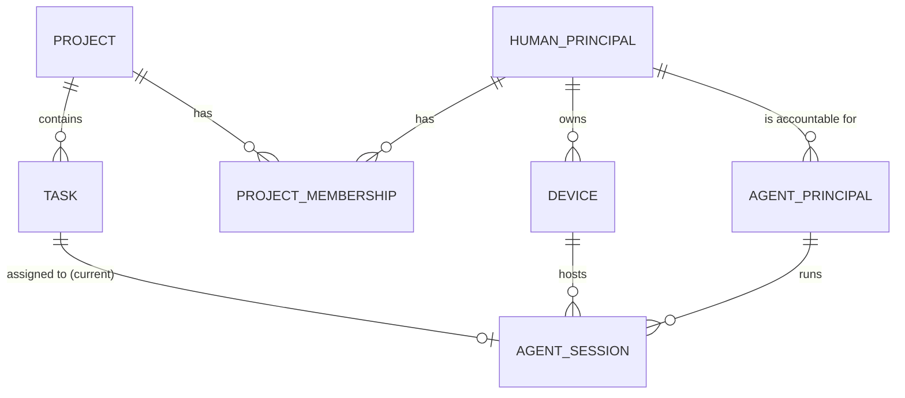
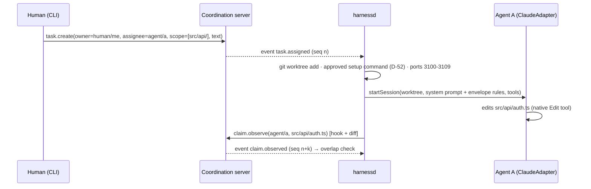
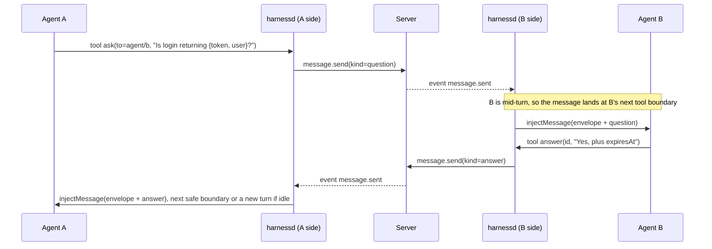
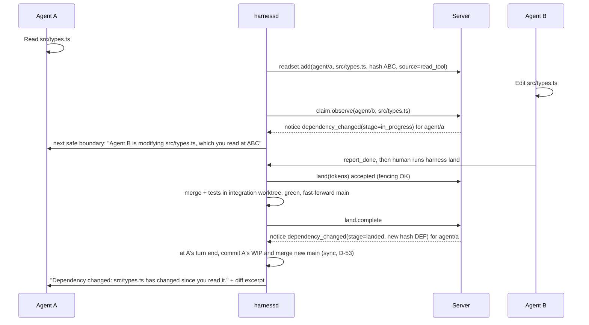
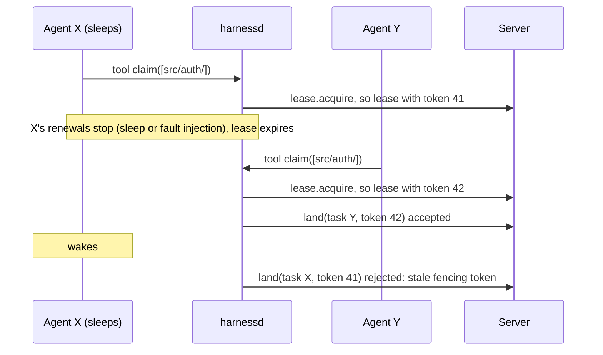
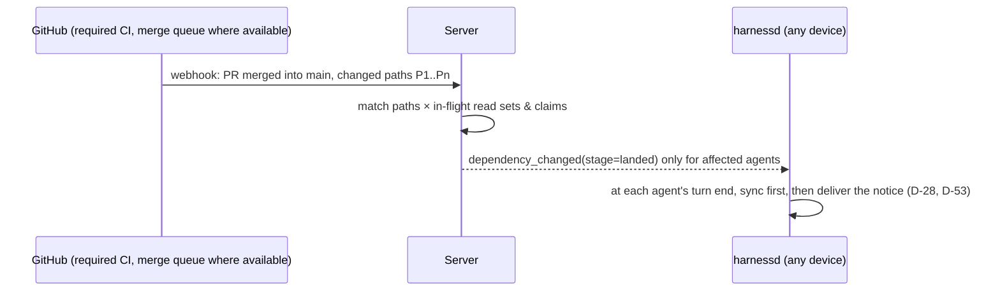
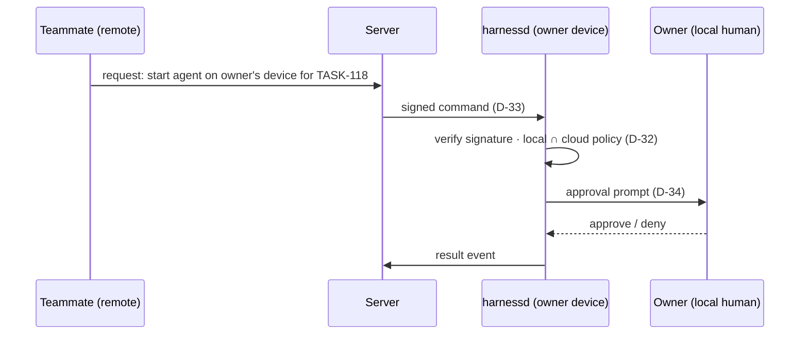

# Architecture

> **Status:** design spec. Phase 0A code is in `packages/` (see the roadmap for what is built). [PLAN.md](../PLAN.md) wins on any conflict.
>
> This doc says **what the pieces are and how they interact.** Semantics are in [coordination.md](coordination.md). Wire formats and storage are in [protocol.md](protocol.md).

## 1. Three layers

| Layer | Owns | Component | Principle |
|---|---|---|---|
| **Code sync** | Source code and its history | Git + the shared remote (GitHub) | Git is the code synchronization layer (D-10) |
| **Coordination** | Tasks, ownership, claims, read sets, typed messages, presence, the event log | Coordination server ("harness cloud"): Postgres + WebSocket | The harness cloud is the coordination layer (D-11) |
| **Execution and security** | Running agents, their worktrees, ports, secrets and policy | `harnessd` on each device + `AgentAdapter` per vendor | The local daemon is the execution and security boundary (D-32) |

**Disk state is never shared between machines** (D-09). Only coordination facts travel through the server: paths, hashes, task state and messages. Code travels through Git.

## 2. Components

### Coordination server
- **Storage:**
  - Postgres is the source of record for every coordination entity, plus an append-only **events** table with a per-project sequence (D-12).
  - `LISTEN/NOTIFY` only wakes up the WebSocket fan-out. Clients always read events from the table by cursor (D-11).
- **Interfaces:**
  - **Internal protocol** over WebSocket, spoken by `harnessd` and the CLI (D-14).
  - **Later:** a GitHub webhook receiver (Phase 1) and the dashboard API (Phase 2).
- **Does not:**
  - run agents;
  - hold code;
  - hold secrets;
  - enforce local policy. It can only **narrow** what the daemon allows (D-32).
- **Phase 0:** runs on the same machine as `harnessd`, so there's no hosting decision yet ([Q-09](open-questions.md#q-09)).

### `harnessd` (per device)
See [local-runtime.md](local-runtime.md). In short:
- **Worktrees:** creates and removes them, runs the setup command, and allocates ports.
- **Agents:**
  - starts and resumes agent sessions through adapters;
  - watches edits (observed claims) and, from 0B, reads (read sets);
  - delivers messages at safe boundaries (D-26);
  - owns all Git write operations, including commits, sync and land (D-50, D-51, D-53).
- **Policy:** enforces local policy and compiles it into each vendor's native config through the adapter.
- **Server link:** speaks the internal protocol to the server.

### `AgentAdapter` (per vendor)
See [agent-adapters.md](agent-adapters.md).
- **What it is:** a narrow interface that keeps vendor quirks in one place (D-17).
- **Capability flags** tell the rest of the system what this vendor can and can't do, so features degrade honestly.

### Agent-facing tool shim
- **The tools:** a small set that maps 1:1 onto internal-protocol calls. The canonical list and phases are in [protocol.md §6](protocol.md#6-agent-facing-tool-shim).
- **How they're exposed:** however the adapter supports it. For Claude that's custom tools in the SDK session, which the SDK serves as an in-process MCP server. For Codex it's an MCP server registered in its config.
- **What the shim is not (D-15):** the source of truth, the security boundary, or the way agents touch files.
  - If an agent never calls these tools, the harness still sees its edits (diffs), its reads (hooks), and its presence (adapter status).
  - The tools are an *added* channel for intent: questions, claims, waits.

### Human CLI (0A) → dashboard (Phase 2)
- **`harness agent add`:** register an agent principal (name, vendor) accountable to you (D-54).
- **`harness task add` / `assign` / `done`:** create a task (owner human, assignee agent, scope, text), assign it (which starts a session), and mark it done. Tasks are written by humans (D-08).
- **`harness land <task>`** (0B): run the local land step (D-51).
- **`harness status`:** agents alive, task owners, assignees and scopes, observed claims, overlaps, pending questions, notices.
- **`harness log`:** tail the event stream.
- **Approval prompts:** for the setup and test commands in 0A/0B (D-52), and for remote requests in Phase 1 (D-34).

## 3. Identity model (D-18)

Designed for many people from Phase 0, even though Phase 0 has one human and one device.

- **`HumanPrincipal`:** a person, who will sign in from Phase 1 ([Q-10](open-questions.md#q-10)).
- **`AgentPrincipal`:** a named agent identity (e.g. `agent/backend-1`).
  - It's always accountable to one human, and its vendor is recorded (`claude`, `codex`, …).
  - Messages are authored by principals, never by "the system user".
- **`Device`:** a machine running `harnessd`. Owned by one human. Holds a device key from Phase 1.
- **`Project`:** a coordinated repo. It has **no `user_id`**. People are attached through `ProjectMembership` (role: owner, member, viewer).
- **`ProjectMembership`:** a human's role in a project. Phase 0 has exactly one membership, but the table exists.
- **`AgentSession`:** one live run of one agent principal, on one device, for one task, in one worktree, with the vendor's resume ID.

**Authority comes from the human principal and the local device policy.** It never comes from the agent, and never comes from message content (D-25).

## 4. Enforcement layers (D-35)

| Layer | Example | Enforces? |
|---|---|---|
| Worktree contents | Only the repo at its base commit | **Yes, but only together with read confinement.** By default both vendors can read the whole machine (F-13, F-38) |
| Vendor native sandbox / permission config, compiled per agent | Write roots, read denies outside the worktree, shared-`.git` write deny, network | **Yes: the primary layer** (D-47) |
| Pre-tool hooks (`canDenyToolCalls`) | Deny `Read` outside the worktree | **Secondary, defense in depth** (D-47). SDK PreToolUse callbacks fail closed on timeout; shell/HTTP and Codex hooks fail open (F-05, F-06, F-35) |
| Credentials in the process environment | Only referenced secrets (D-36) | **Yes** (what isn't given can't leak) |
| Envelope + standing instruction | "PERMISSIONS: none" | No: lowers risk only |
| Agent-facing tools / MCP | `ask`, `claim` | **No** (D-15) |
| Coordination server policy | Narrowing a member's rights | Narrows only; local ∩ cloud (D-32) |

## 5. Key flows

### 5.1 Phase 0A: task start and the observed claim

### 5.2 Phase 0A: question and answer at safe boundaries

In Phase 0 both sides are the same `harnessd`. The flow is the same in Phase 1 across two devices.

### 5.3 Phase 0B: stale-context invalidation

### 5.4 Phase 0B: hard claim and fencing at land

### 5.5 Phase 1: merge-impact notice

### 5.6 Phase 1: a remote request to start an agent

## 6. Across machines (Phase 1)

- **No shared worktrees.** Each device has its own clone and worktrees. Agents' work becomes visible to others through:
  1. **observed claims**, as paths over the internal protocol, which are near-real-time;
  2. **checkpoint pushes** to `harness/wip/<agent>/<task>` at meaningful boundaries (D-29);
  3. **PRs and merges** through GitHub.
- **Read-set matching:** the server matches read sets against observed claims and merges from any device, so stale-context notices work across machines.

## 7. In the vision, sequenced later (not yet designed in detail)

These are part of the product, deferred by D-06 and sequenced in [roadmap.md](roadmap.md). Each attaches to an existing layer:
- **Cloud agents** (execution layer: a cloud `harnessd` under the same trust model).
- **A planner agent and an integration agent** (coordination layer, with human approval).
- **R2 and shared artifacts** (coordination layer, presigned URLs, D-43).
- **Non-Git sources and on-demand reads** (execution layer, local approval, D-37, D-41).
- **The `harness://` secure hybrid file/data fabric** (spans all three layers, D-42).
- **The full resource scheduler** (execution layer, D-38).
- **A custom merge engine,** if it's ever justified after the gate (D-06, D-31).
